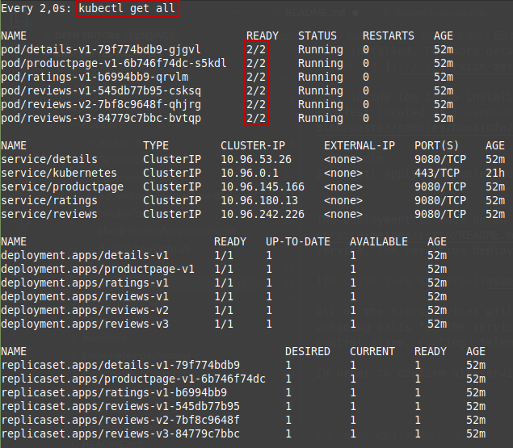
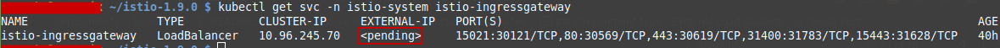
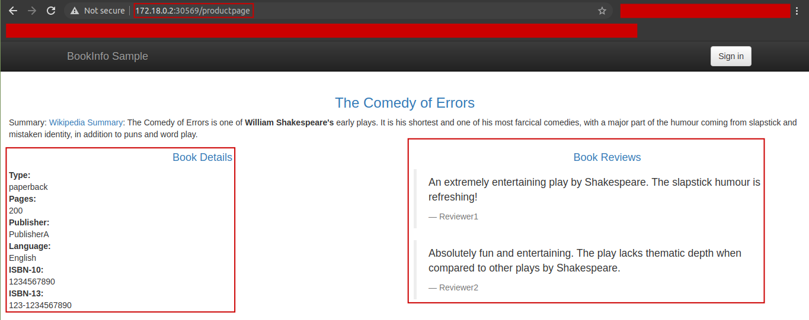

This application displays information about a book, similar to a single catalog entry of an online book store. Displayed on the page is a description of the book, book details (ISBN, number of pages, and so on), and a few book reviews.

# Architecture

The Bookinfo application is broken into four separate microservices (see image):

* `productpage`. The `productpage` microservice calls the details and reviews microservices to populate the page.
* `details`. The `details` microservice contains book information.
* `reviews`. The `reviews` microservice contains book reviews. It also calls the ratings microservice.
* `ratings`. The `ratings` microservice contains book ranking information that accompanies a book review.


> :memo: NOTE
>
> There are 3 versions of the reviews microservice:
> * Version v1 doesn’t call the ratings service.
> * Version v2 calls the ratings service, and displays each rating as 1 to 5 black stars.
> * Version v3 calls the ratings service, and displays each rating as 1 to 5 red stars.

The application is polyglot, i.e., the microservices are written in different languages. It’s worth noting that these services have no dependencies on Istio, but make an interesting service mesh example, particularly because of the multitude of services, languages and versions for the reviews service.

# Installation

In order to deploy the `Bookinfo` sample application we must apply the manifest shipped with Istio when installed. For more details about Istio installation, please check [`service-meshes/istio/README.md`](../../service-meshes/istio/README.md#istio-installation)

Once inside the istio installation folder (mine's at `HOME/istio-1.9.0`), we proceed to apply the manifest located at [`samples/bookinfo/platform/kube/bookinfo.yaml`](https://github.com/istio/istio/blob/master/samples/bookinfo/platform/kube/bookinfo.yaml):

```console
$ kubectl apply -f samples/bookinfo/platform/kube/bookinfo.yaml
```

> :eyes: NOTE
>
> The `samples/bookinfo/platform/kube/bookinfo.yaml` manifest does NOT have resource limits, which can be a vulnerability in a real world scenario. A resource bounded manifest can be found at  [`deployments/bookinfo/bookinfo-resource-bounded.yaml`](bookinfo-resource-bounded.yaml)

The deployment is made on an `Istio-enabled` Kubernetes cluster as mentioned [`before`](../../service-meshes/istio/README.md#istio-installation), Envoy sidecars are injected along side each service. The resulting deployment will look like this:


All of the microservices will be packaged with an `Envoy` sidecar that intercepts incoming and outgoing calls for the services, providing the hooks needed to externally control, via the Istio control plane, routing, telemetry collection, and policy enforcement for the application as a whole.

In order to confirm all services and pods (all pods are ready `2/2`)are correctly defined run:



To confirm that the Bookinfo application is running, send a request to it by a `curl` command from some pod, for example from `ratings`:

```console
RATINGS_POD="$(kubectl get pod -l app=ratings -o jsonpath='{.items[0].metadata.name}')"
URL="productpage:9080/productpage"
kubectl exec $RATINGS_POD -c ratings -- curl -sS $URL | grep -o "<title>.*</title>"
```

or simply by running the `check-bookinfo-app-is-deployed` make target on this repo:

```console
$ make check-bookinfo-app-is-deployed
```

> :memo: NOTE
>
> The command launches all four services shown in the `bookinfo` application architecture diagram. All 3 versions of the reviews service, v1, v2, and v3, are started. In a realistic deployment, new versions of a microservice are deployed over time instead of deploying all versions simultaneously.

# Expose Bookinfo from outside Kubernetes

Now that the Bookinfo services are up and running, you need to make the application accessible from outside of your Kubernetes cluster, e.g., from a browser. An [Istio Gateway](https://istio.io/latest/docs/concepts/traffic-management/#gateways) is used for this purpose.

## Environment type: `External Load Balancer` or `Node Port`

Before defining the ingress gateway, we must determine which kind of environment we have: `External Load Balancer` or `Node Port`. In order to know that, we execute the following command to determine if your Kubernetes cluster is running in an environment that supports external load balancers:

```console
$ kubectl get svc -n istio-system istio-ingressgateway
```



If the `EXTERNAL-IP` value is set, your environment has an external load balancer that you can use for the ingress gateway. If the `EXTERNAL-IP` value is `<none>` (or perpetually `<pending>`), your environment does not provide an external load balancer for the ingress gateway. In this case, you can access the gateway using the service's [node port](https://kubernetes.io/docs/concepts/services-networking/service/#nodeport).

> :eyes: As we can see, in our case we'll use the `Node Port` to access the gateway. For more information, check [this](https://istio.io/latest/docs/tasks/traffic-management/ingress/ingress-control/#determining-the-ingress-ip-and-ports)

## Deploy Gateway for Bookinfo

<a id="deploy-gateway-bookinfo"></a>

First, we define the ingress gateway for the application (manifest located on folder `HOME/istio-1.9.0`):

```console
$ kubectl apply -f samples/bookinfo/networking/bookinfo-gateway.yaml
gateway.networking.istio.io/bookinfo-gateway created
virtualservice.networking.istio.io/bookinfo created
```

Next, we confirm the gateway has been created:
```console
$ kubectl get gateways.networking.istio.io
NAME               AGE
bookinfo-gateway   31s
```

## Determine the Gateway URL

Once the gateway resource has been created, we need to determine the Gateway URL. i.e., the ingress IP and Port where the application will be accesible. For that, we'll set the `INGRESS_HOST`, `INGRESS_PORT` and `SECURE_INGRESS_PORT` environment variables.

> **TL;DR:** All the instructions can be simply executed by:
>
> ```console
> $ bash deployments/bookinfo/set-gateway-url.sh
> ```

The instructions for that are the following:

```console
$ export INGRESS_HOST=$(kubectl get po -l istio=ingressgateway -n istio-system -o jsonpath='{.items[0].status.hostIP}')
$ export INGRESS_PORT=$(kubectl -n istio-system get service istio-ingressgateway -o jsonpath='{.spec.ports[?(@.name=="http2")].nodePort}')
$ export SECURE_INGRESS_PORT=$(kubectl -n istio-system get service istio-ingressgateway -o jsonpath='{.spec.ports[?(@.name=="https")].nodePort}')
```

Once the `INGRESS_HOST` and `INGRESS_PORT` are set, we can define the `GATEWAY_URL` as:

```console
$ export GATEWAY_URL=$INGRESS_HOST:$INGRESS_PORT
```

To verify if we can access the Bookinfo app from outside the cluster, we can access it from the browser to http://$GATEWAY_URL/productpage to view the Bookinfo web page:



If you refresh the page several times, you should see different versions of reviews shown in productpage, presented in a round robin style (red stars, black stars, no stars), since we haven’t yet used Istio to control the version routing.

Also, we could perform a `curl` request from the command line:

```console
$ curl -s "http://${GATEWAY_URL}/productpage" | grep -o "<title>.*</title>"
<title>Simple Bookstore App</title>
```

For more details, read [this](https://istio.io/latest/docs/tasks/traffic-management/ingress/ingress-control/#determining-the-ingress-ip-and-ports).

# Request routing

Request routing (for beginners)

https://istio.io/latest/docs/tasks/traffic-management/request-routing/

# Other References
* https://istio.io/latest/docs/examples/bookinfo/
* https://www.youtube.com/watch?v=16fgzklcF7Y&t=798s
