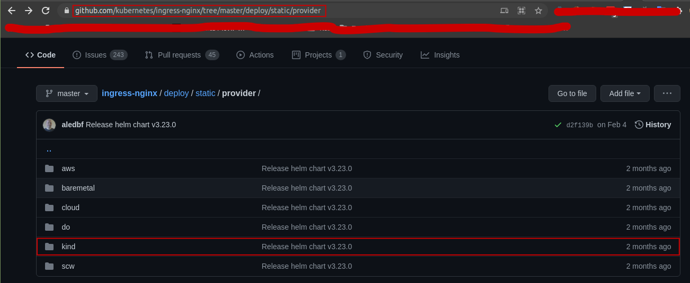
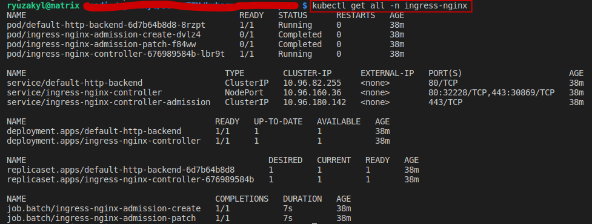

# Installation

In order to deploy/install the Kubernetes NGINX Controller, we use the corresponding (in our case for KinD) manifest files to set it up.

From the [official repo](https://github.com/kubernetes/ingress-nginx), we use the manifest configuration file corresponding to our [specific provider](https://github.com/kubernetes/ingress-nginx/tree/master/deploy/static/provider):

In our case, we'll choose the **deploy.yaml** manifest for `KinD`, which can also be locally found at `ingress/providers/kind/deploy.yaml`.

Once deployed, these are the **Kubernetes objects** created:

