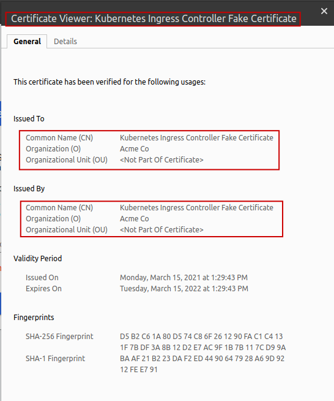
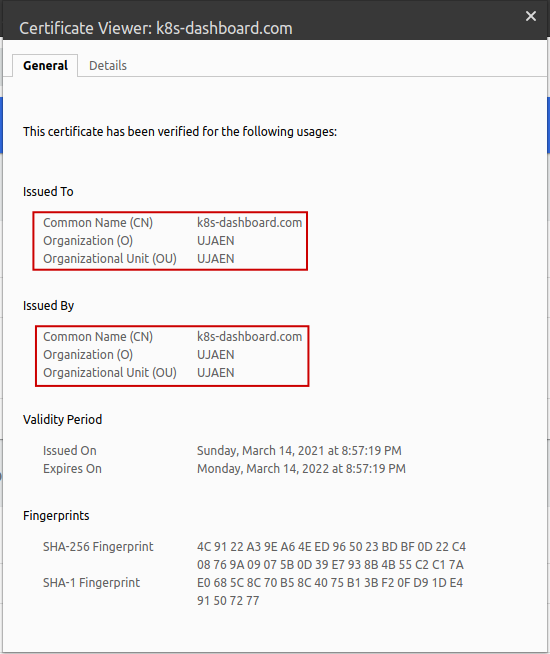
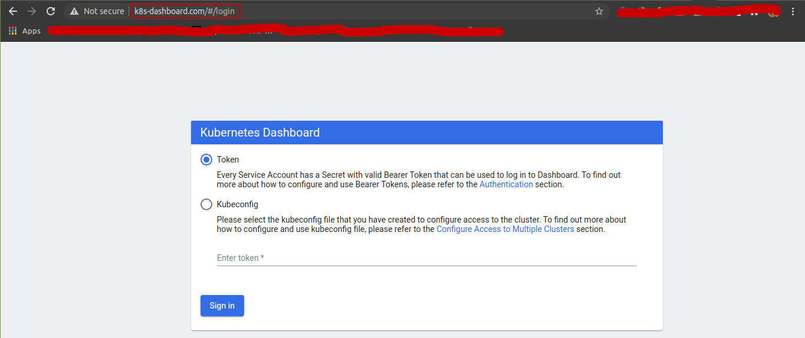
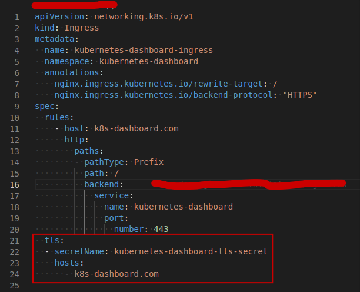
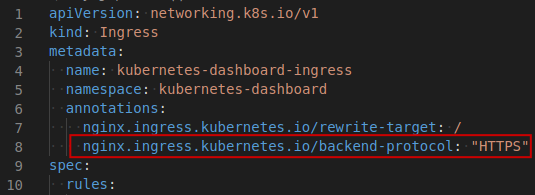

# Ingress Resource to access the Kubernetes Dashboard from outside the cluster

> These instructions assume the **Kubernetes Dashboard** service has been deployed over **HTTPS**, i.e. the service endpoints are expecting **HTTPS** connections.
The **Kubernetes Dashboard** service deployed on this repo is expecting connections over port **8443**.

## Deploy the Ingress Resource

> **TL;DR** Check the following make target:
> ```console
> $ make deploy-dashboard-ingress
> ```

For Ingress Resources, there are mainly two kinds of ingress rules:
* Host-based
* Path-based

> Exposing the **Kubernetes Dashboard** UI over a path would result in an issue: see how to serve (or make accessible) the static assets of the web interface. For that reason, we'll go with the *Host-based* approach.
>
> A *.yaml* config file describing such *Path-based* approach can be consulted at: [dashboard-ingress-path.yaml](dashboard-ingress-path.yaml)
>
> **NOTE:** This file has not been extensively tested. So... *reader discretion is advised*, :stuck_out_tongue_winking_eye:.


The steps required to have the **Kubernetes Dashboard** UI accesible from outside the cluster, we must do the following:

**1. Define the domain where it will be available**

The right way to go here is to buy a domain and make it point to your cloud provided's Load Balancer (or your cluster's [MetalLB](https://metallb.universe.tf/)).

Since this is a simple tutorial, we'll have to "hack" this part. We'll resort to [using an /etc/hosts file for custom domains during development](https://support.acquia.com/hc/en-us/articles/360004175973-Using-an-etc-hosts-file-for-custom-domains-during-development).

Let's say we want to expose the **Kubernetes Dashboard** UI on *k8s-dashboard.com*
Once we've made the changes described on the previous link, we check it is working:

```console
$ nslookup k8s-dashboard.com
Server:		127.0.0.53
Address:	127.0.0.53#53

Non-authoritative answer:
Name:	k8s-dashboard.com
Address: 127.0.0.1
```

**2. Generate certificates, Kubernetes Secret and the Ingress Resource config file**

> :information_source::bell: **IMPORTANT!!** This step is **OPTIONAL** and in case we don't do it, the Ingress itself will provide a certificate for us:
> 
>
> In case we do it, we would see the following certificate when accessing *k8s-dashboard.com*:
> 

In order to configure TLS for the Ingress Resource, we first need to create a certificate that will be used on the Kubernetes Secret that will be referenced on the Ingress Resource config file.

**Generating the certificate:**

Detailed instructions about using OpenSSL to generate the certificate can be found [here](https://shocksolution.com/2018/12/14/creating-kubernetes-secrets-using-tls-ssl-as-an-example/). Check the troubleshooting section to avoid running into certificate-related issues.

**Creating the Kubernetes Secret:**

The TLS secret must contain keys named *certificate.crt* and *certificate.key* that contain the certificate and private key to use for TLS.

In order to comunicate with the Ingress Controller via TLS, we need to create a **Kubernetes Secret**. With the **certificate** and **key** created, we create the secret with:

```console
$ kubectl create secret tls kubernetes-dashboard-tls-secret --key="certificate.key" --cert="certificate.crt"
```

**3. Deploy the Ingress Resource and verify it is actually working properly**

The Host-based Ingress Resource .yaml [config file](dashboard-ingress-host.yaml) can be applied like follows:

```console
$ kubectl apply -f ingress/kubernetes-dashboard/dashboard-ingress-host.yaml
```

It should show the Kubernetes Dashboard UI interface:



To enter it, you can either use the kubeconfig file or the authorization token. To get the token, you can user the following make target:

> ```console
> $ make get-dashboard-login-token
> ```

## Troubleshooting

### Getting error: "Client sent an HTTP request to an HTTPS server."

The reason is the client is initiating an HTTP connection, but the end service is listening over HTTPS.

Two possibilities might be the root cause:
1. The client is not connecting via HTTPS and is simply typing **http://** on the browser. Unlikely because modern browsers automatically switch to **https://**.
2. The Ingress Controller is trying to connect to the service via HTTP.

For this last case we have to make sure that our config file is including the TLS configuration for that host. You can secure an Ingress by specifying a Secret that contains a TLS private key and certificate ([read more](https://kubernetes.io/docs/concepts/services-networking/ingress/#tls)).



### Getting error: HTTP 400 "Connection reset by peer"

If your connection is being rejected by the **Kubernetes Dashboard** service with a message similar to this one:

> 2020/08/28 01:25:58 [error] 2609#2609: *795 readv() failed (104: Connection reset by peer) while reading upstream, client: 10.0.0.25, server: kube.example.com, request: "GET / HTTP/1.1", upstream: "http://10.42.0.2:8443/", host: "kube.example.com"

Notice the protocol part of the destination URL trying to be reached: **http://**. This indicates the **Ingress controller** is trying to reach the service via **HTTP** and therefore, the connection is being reset by peer ([read more](https://github.com/helm/charts/issues/5007#issuecomment-425151443)).

From the docs:
> The Ingress resource only supports a single TLS port, 443, and assumes TLS termination at the ingress point (traffic to the Service and its Pods is in plaintext).

Indeed, NGINX is proxying the HTTP request to "http://10.42.0.2:8443/", which is an HTTPS endpoint, using HTTP as protocol ([read more](https://stackoverflow.com/questions/48324760/ingress-configuration-for-dashboard)).

To fix this, we need to indicate the **Ingress Controller** to forward the request to the pods with HTTPS. For that we need the following annotation: **nginx.ingress.kubernetes.io/backend-protocol: "HTTPS"** ([read more](https://kubernetes.github.io/ingress-nginx/user-guide/nginx-configuration/annotations/#backend-protocol)).



### Getting SSL Certificate validation error

So your Ingress Resource is not working, you check the logs of the nginx-ingress-controller pod and see the following:

> Unexpected error validating SSL certificate "kubernetes-dashboard/kubernetes-dashboard-tls-secret" for server "k8s-dashboard.com": x509: certificate relies on legacy Common Name field, use SANs or temporarily enable Common Name matching with **GODEBUG=x509ignoreCN=0**

For more details about this issue, check [this issue](https://github.com/kubernetes/ingress-nginx/issues/6559).

From the information on the error message, one possible solution would be to add the **GODEBUG=x509ignoreCN=0** config to the **ingress-nginx-controller**. By passing an environment variable **GODEBUG** with value **x509ignoreCN=0** should do the trick.

If you don't want to change/edit an already deployed **ingress-nginx-controller**, the solution is to re-generate the certificate and re-deploy (or update) the Ingress Resource.

> **TL;DR** Check the following make target:
> ```console
> $ make generate-dashboard-certificate
> ```

Initially [these](https://github.com/kubernetes/dashboard/blob/master/docs/user/certificate-management.md) are the instructions used to generate the certificate needed on the **Kubernetes Secret**.

The [new instructions](https://www.ssls.com/knowledgebase/how-to-fill-in-the-san-fields-in-the-csr/) to generate the certificate mainly differ on the way the *Certificate Signing Request* (*.csr file) is generated.

Once the **.csr** has been generated this way, we user the same steps to create the **Kubernetes Secret** and deploy the **Ingress Resource**.

## Other References:
* (Some further troubleshooting) https://medium.com/@ManagedKube/kubernetes-troubleshooting-ingress-and-services-traffic-flows-547ea867b120
* (How to properly configure access to kubernees dashboard behind nginx ingress) https://serverfault.com/questions/1019919/how-to-properly-configure-access-to-kubernees-dashboard-behind-nginx-ingress
* (Expose the Dashboard outside the cluster) https://stackoverflow.com/questions/39864385/how-to-access-expose-kubernetes-dashboard-service-outside-of-a-cluster
* (How to Create a CSR and Key File for a SAN Certificate with Multiple Subject Alternate Names) https://security.stackexchange.com/questions/74345/provide-subjectaltname-to-openssl-directly-on-the-command-line, https://serverfault.com/questions/455525/openssl-how-to-generate-a-csr-with-interactively-solicited-subject-alternative, https://support.citrix.com/article/CTX227983
* (HTTP 400 to Kubernetes Dashboard) https://serverfault.com/questions/1031810/400-error-with-nginx-ingress-to-kubernetes-dashboard