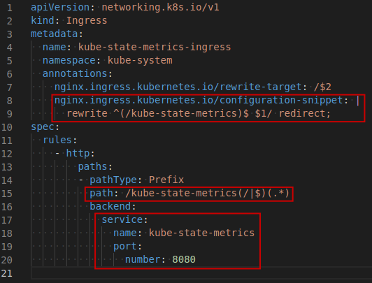
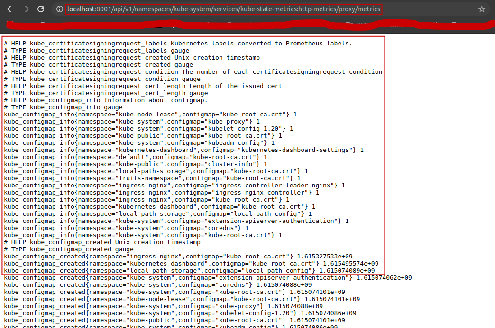
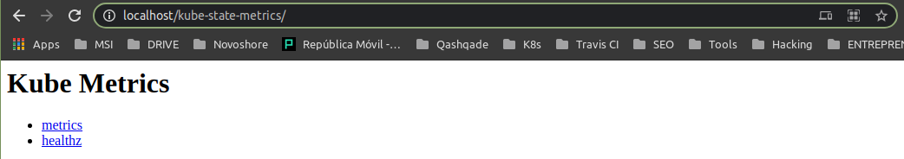
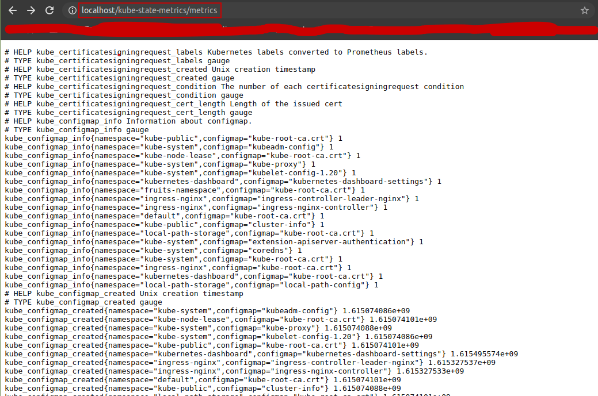

# How to install?

* https://www.datadoghq.com/blog/how-to-collect-and-graph-kubernetes-metrics/#add-kube-state-metrics-to-your-cluster

Install from config files on the standard folder:
https://github.com/kubernetes/kube-state-metrics/tree/master/examples/standard

kubectl proxy

http://localhost:8001/api/v1/namespaces/kube-system/services/kube-state-metrics:http-metrics/proxy/metrics

## Exposing `kube-state-metrics` via Ingress

# `kube-state-metrics` on Sysdig Monitor

https://sysdig.com/blog/introducing-kube-state-metrics/

# `kube-state-metrics` on Grafana

https://grafana.com/grafana/dashboards/13332

# Other References:
* https://www.datadoghq.com/blog/how-to-collect-and-graph-kubernetes-metrics