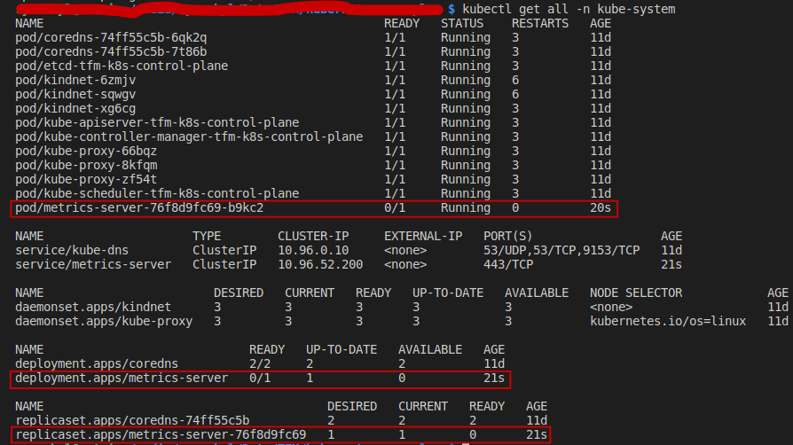
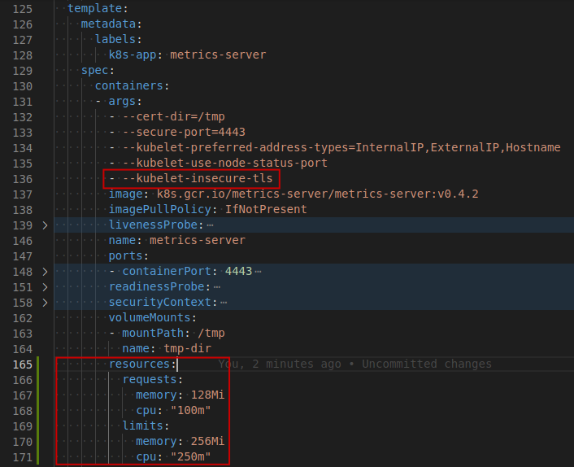
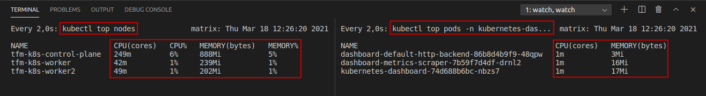
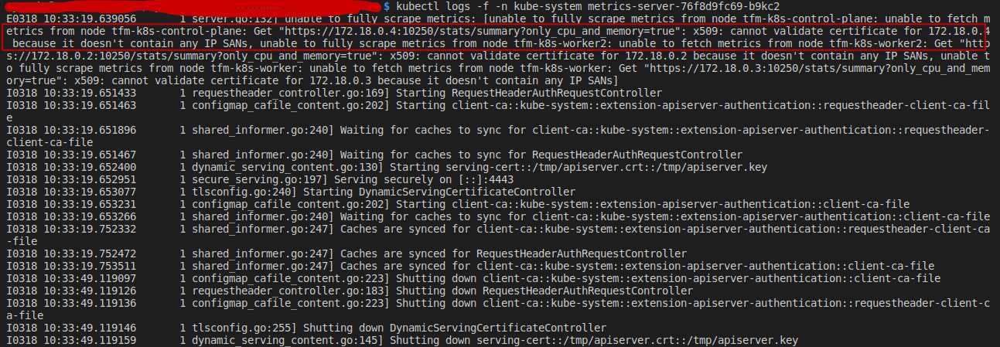

# How to Deploy

> **TL;DR** The final config file to deploy the *metrics-server* is [metrics-server.yaml](monitoring/metrics-server/metrics-server.yaml).

From the official [repo](https://github.com/kubernetes-sigs/metrics-server):
> The latest Metrics Server release can be installed by running:
>
> kubectl apply -f https://github.com/kubernetes-sigs/metrics-server/releases/latest/download/components.yaml

Once the resources have been applied, we notice it is not working:

.

Two things that need to be fixed on the .yaml file:
1. Enable insecure usage (ONLY for internal or test clusters)
2. Apply resource limits for security ([learn more](https://www.youtube.com/watch?v=xjpHggHKm78))

The changes would be the following:

.

Once it's re-applied, we can make use of commands like **kubectl top nodes** and **kubectl top pods** that depend on the *metrics-server* being properly deployed:

### Configuration

From the official [repo](https://github.com/kubernetes-sigs/metrics-server):

> Depending on your cluster setup, you may also need to change flags passed to the Metrics Server container. Most useful flags:
> * --kubelet-preferred-address-types - The priority of node address types used when determining an address for connecting to a particular node (default [Hostname,InternalDNS,InternalIP,ExternalDNS,ExternalIP])
> * --kubelet-insecure-tls - Do not verify the CA of serving certificates presented by Kubelets. For testing purposes only.
> * --requestheader-client-ca-file - Specify a root certificate bundle for verifying client certificates on incoming requests.

# Troubleshooting

### Fixing certificate related issues

If you're getting the following error on your pod:
>  x509: cannot validate certificate for 172.18.0.4 because it doesn't contain any IP SANs, unable to fully scrape metrics from node tfm-k8s-worker2
>
> These are the pod logs you might be getting:
> 

The **root cause** of the error is a TLS Handshake error due to some certificate issues.

SSL needs identification of the peer, otherwise your connection might be against a man-in-the-middle which decrypts + sniffs/modifies the data and then forwards them encrypted again to the real target.

Identification is done with x509 certificates which need to be validated against a trusted CA and which need to identify the target you want to connect to.

For more information, check [here](https://serverfault.com/questions/611120/failed-tls-handshake-does-not-contain-any-ip-sans)

The error is due to the self-signed TLS certificate. To solve it, we need to add the **--kubelet-insecure-tls** argument to the **k8s.gcr.io/metrics-server/metrics-server:v0.4.2** container ([read more](https://github.com/kubernetes-sigs/metrics-server#configuration)) and re-apply the .yaml config file on the K8s cluster. This should fix the issue.

> **IMPORTANT:**
>
>  The previous fix this SHOULD NOT be used in a *"production"* cluster, i.e. exposed to end users. This fix makes sense for playing around with clusters, or for internal clusters, but always be aware when using this on the real world.

# Other References:
* https://www.sysspace.net/post/kubernetes-cluster-and-pod-resource-monitoring
* https://github.com/kubernetes-sigs/metrics-server/issues/196
* https://stackoverflow.com/questions/64767239/kubernetes-metrics-server-not-running
* https://github.com/kubernetes-sigs/metrics-server/issues/131
