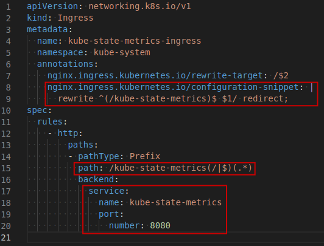
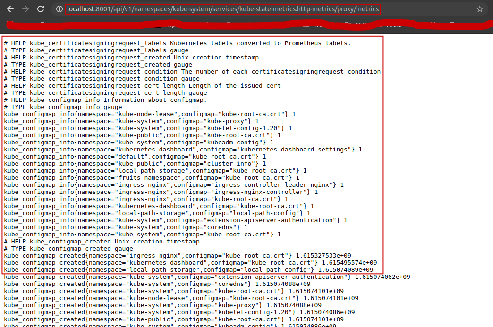
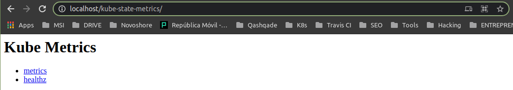
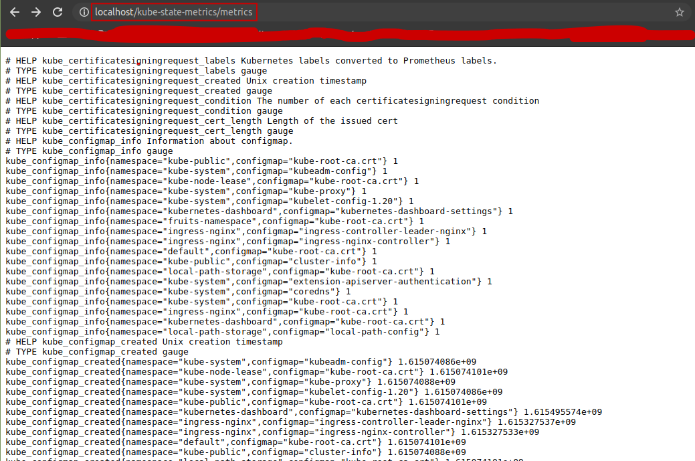

# How to install?

<script src="https://gist.github.com/ryuzakyl/569b3b993d836344aaecdd21f6f22c7d.js"></script>

From the official [kube-state-metrics](https://github.com/kubernetes/kube-state-metrics) repository:
> To deploy this project, you can simply run `kubectl apply -f examples/standard` and a Kubernetes service and deployment will be created.

Therefore, the instructions would be the following:
```console
$ git clone https://github.com/kubernetes/kube-state-metrics.git
$ cd kube-state-metrics
$ kubectl apply -f examples/standard
```

Once it is deployed, we can a

* https://www.datadoghq.com/blog/how-to-collect-and-graph-kubernetes-metrics/#add-kube-state-metrics-to-your-cluster


Install from config files on the standard folder:
https://github.com/kubernetes/kube-state-metrics/tree/master/examples/standard


kubectl proxy

http://localhost:8001/api/v1/namespaces/kube-system/services/kube-state-metrics:http-metrics/proxy/metrics

## Exposing `kube-state-metrics` via Ingress









# `kube-state-metrics` on Sysdig Monitor

https://sysdig.com/blog/introducing-kube-state-metrics/

# `kube-state-metrics` on Grafana

https://grafana.com/grafana/dashboards/13332

# Other References:
* https://www.datadoghq.com/blog/how-to-collect-and-graph-kubernetes-metrics