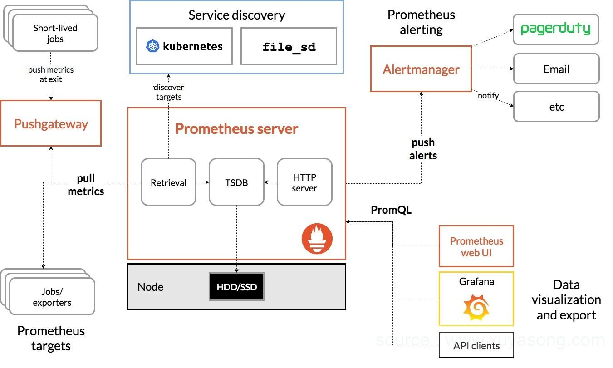

Prometheus is an open source, metrics-based monitoring system. It has a simple yet powerful data model and a query language that lets you analyse how your applications and infrastructure are performing.

Prometheus pulls metrics (key/value) and stores the data as time-series, allowing users to query data and alert in a real-time fashion. At given intervals, Prometheus will hit targets to collect metrics, aggregate data, show data, or even alert if some thresholds are met.

For instrumenting your own code, Prometheus has client libraries for applications written in Go, Java, Ruby, and Python. Other languages like C#, Node.js, or Rust have support as well, but they’re not official (yet). And for those short-lived applications like batch jobs, Prometheus can push metrics with a [PushGateway](https://github.com/prometheus/pushgateway).

> :bulb: **NOTE**
>
> Keep in mind that the preferable way to collect data is to pull metrics from an application’s endpoint.

# Architecture

Prometheus is composed of multiple components, each onea having a specific function. These are:



**The Prometheus Server**
Responsible for pulling and storing monitoring data from Exporter and providing a flexible query language (`PromQL`)

* **Retrieval**: sampling module
* **TSDB**: The storage module defaults to local storage as tsdb
* **HTTP Server**: Provide http interface query and panel, the default port is **9090**

It collects metrics in the form of time series data from nodes and stores them. The process of collecting metrics is referred to as scraping. Prometheus server does all the heavy lifting. All they have to do is expose their metrics in a way that the Prometheus server can access. They do this by exposing an HTTP endpoint, usually /metrics, which returns the full list of metrics (with accompanying label sets) and their values.

**Exporters/Jobs**
As mentioned earlier, clients simply have to expose their metrics for Prometheus to scrape, but this data has to be in a format that Prometheus understands. Prometheus stores data in a time series format, and only accepts data of that form. Metrics exposed by clients have to be in this format for Prometheus to scrape. However, time series formatted metrics do not typically spring forth from applications.

Instrumentation that produces these types of metrics often has to be manually added.This can be done in two ways:

1. We have **control of the source code** of the application whose metrics you want sent to Prometheus.
With very few lines of code, you can define and add your desired metrics using Prometheus' `client libraries` in a process called `direct instrumentation`.

2. We **do NOT have control of the source code** of the application/service we want to monitor.
In this case, `direct instrumentation` is not an option because we can’t use `client libraries` to export the metrics. In this case, we use [exporters](https://prometheus.io/docs/instrumenting/exporters/). Exporters are pieces of software that:
* Fetches statistics from another, non-Prometheus system
* Turn those statistics into Prometheus metrics, using a `client library`.
* Enables the `/metrics` endpoint, and have that URL display the system metrics

> :bulb: INFO
> The **exporters** can be deployed alongside the applications whose metrics you're interested in.

For more details about **exporters** read [this](https://alanstorm.com/what-are-prometheus-exporters), [this](https://prometheus.io/docs/instrumenting/exporters/) and/or [this](https://www.metricfire.com/blog/first-contact-with-prometheus/).

**Clients libraries/SDKs**

Client libraries handle all the essential details, such as bookkeeping or thread-safety, and sends out your metrics in a format that can be directly scraped by Prometheus, leaving the user with very little to do. Most libraries also provide certain metrics such as CPU usage and garbage collection statistics out of the box depending on the runtime environment and the library being used.

# Install

manifests are in folder:
https://github.com/prometheus-operator/kube-prometheus/tree/main/manifests

locally we can find them on `observability/monitoring/prometheus/manifests`.

the commands are the following:
```console
# Update the namespace and CRDs, and then wait for them to be available before creating the remaining resources
$ kubectl apply -f manifests/setup
$ kubectl apply -f manifests/
```

https://github.com/prometheus-operator/kube-prometheus#apply-the-kube-prometheus-stack

https://www.youtube.com/watch?v=QoDqxm7ybLc

Several approaches:
1. Manually create and apply (in the required order) all config files
2. Using an operator (Manager of Prometheus components)
3. User Helm chart to deploy the operator


4:40 (https://www.youtube.com/watch?v=QoDqxm7ybLc) explanation of kubernetes objects created and their function

# Metric Types

https://prometheus.io/docs/concepts/metric_types/

1. Counter
2. Gauge
3. Histogram (https://prometheus.io/docs/practices/histograms/, https://www.robustperception.io/how-does-a-prometheus-histogram-work)

## Prometheus metrics compatibility

Talk about OpenMetrics: https://www.robustperception.io/openmetrics-is-released

[Software exposing Prometheus metrics](https://prometheus.io/docs/instrumenting/exporters/#software-exposing-prometheus-metrics)

# Exporters and monitoring Applications

https://www.scalyr.com/blog/prometheus-metrics-by-example/
https://www.youtube.com/watch?v=h4Sl21AKiDg

Describe scenarios of using and writing exporters to expose Prometheus metrics at `/metrics` and instrumenting your applications with Prometheus client libraries.

## Exporters

https://prometheus.io/docs/instrumenting/exporters/

* DB
* Hardware
* Issue Trackers and CI
* Messaging systems
* Storage
* HTTP
* APIs
* Logging
* Other monitoring systems
* Miscellaneous

## Monitoring Applications

Example of metrics for your app:
* How many requests?
* How many exceptions?
* How many server resources are used?

USE method (http://www.brendangregg.com/usemethod.html) and TSA method (http://www.brendangregg.com/tsamethod.html)?

https://prometheus.io/docs/instrumenting/clientlibs/
https://github.com/prometheus/client_python

# Pull system

Advantages over push approach of New Relic or Amazon Cloud Watch

min 12:00 of https://www.youtube.com/watch?v=h4Sl21AKiDg

* (push vs. pull) https://giedrius.blog/2019/05/11/push-vs-pull-in-monitoring-systems/
* https://prometheus.io/blog/2016/07/23/pull-does-not-scale-or-does-it/#:~:text=A%20pull%20approach%20not%20only,or%20inspect%20metrics%20endpoints%20manually.
* https://thenewstack.io/exploring-prometheus-use-cases-brian-brazil/

# Prometheus rules

https://prometheus.io/docs/practices/rules/

Rule examples: https://awesome-prometheus-alerts.grep.to/rules.html

"Unit testing" for rules: https://prometheus.io/docs/prometheus/latest/configuration/unit_testing_rules/

## Recording rules

Is this the same as rules for "aggregating metrics values"?

https://prometheus.io/docs/prometheus/latest/configuration/recording_rules/

## Alerting rules

The alert defined by these kind of rules are triggered by the **Alert Manager**

https://prometheus.io/docs/prometheus/latest/configuration/alerting_rules/

# Prometheus Data Storage

By default Prometheus store data on SSD/HDD, but it can be integrated with Remote Storage Systems (i.e., relational DBs, etc.) and the data is stored in a Custom Time Series Format


## Integration with Remote Storage Systems

[Remote storage integrations](https://prometheus.io/docs/prometheus/latest/storage/#remote-storage-integrations)

https://prometheus.io/docs/operating/integrations/#remote-endpoints-and-storage
https://valyala.medium.com/analyzing-prometheus-data-with-external-tools-5f3e5e147639

# Scaling Prometheus with Cortex

Talk about MetricFire?

Why do need this? min 20:00 of https://www.youtube.com/watch?v=h4Sl21AKiDg

Handling hundreds of services we might want to have multiple Prometheus servers that aggregate all these metrics data and configuring that and scaling Prometheus in that way can be very difficult.

We can:
1. Increase capacity of Prometheus server so it can store more metrics data
2. Limit number of metrics that Prometheus collects from the applications/targets (keep only relevant ones)
3. Prometheus at scale

Other links:
* https://github.com/cortexproject/cortex
* https://www.cncf.io/blog/2018/12/18/cortex-a-multi-tenant-horizontally-scalable-prometheus-as-a-service/
* https://grafana.com/go/webinar/taking-prometheus-to-scale-with-cortex/
* https://platform9.com/blog/kubernetes-monitoring-at-scale-with-prometheus-and-cortex/

# PromQL?

https://www.metricfire.com/blog/getting-started-with-promql/

# Visualization

instructions here
https://github.com/prometheus-operator/kube-prometheus#access-the-dashboards

https://github.com/prometheus-operator/kube-prometheus/blob/main/docs/exposing-prometheus-alertmanager-grafana-ingress.md

## Prometheus UI

Deploy an ingress?

Port forward:
kubectl port-forward -n monitoring service/prometheus-k8s 9090

## Grafana

Deploy an ingress?

Port forward:
kubectl port-forward -n monitoring grafana-665447c488-cwhbm 3000

# Other References:
* [Youtube: How Prometheus Monitoring works | Prometheus Architecture explained](https://www.youtube.com/watch?v=h4Sl21AKiDg)
* [What is Prometheus?](https://www.metricfire.com/blog/what-is-prometheus/)
* [Robust Perception blog](https://www.robustperception.io/blog)
* [Prometheus: Up & Running](https://www.oreilly.com/library/view/prometheus-up/9781492034131/ch01.html)
* https://www.programmersought.com/article/16474076685/