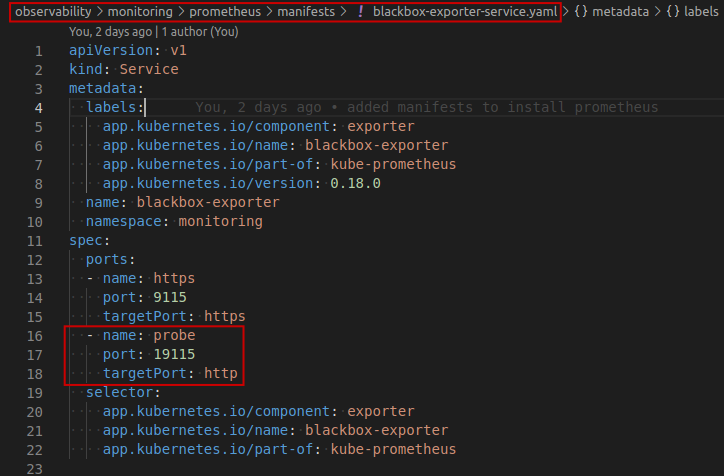
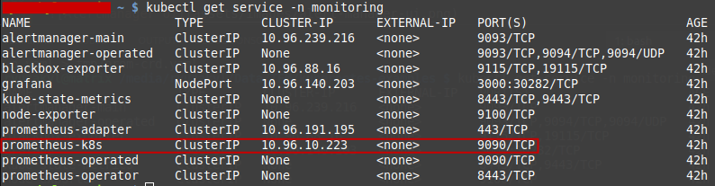
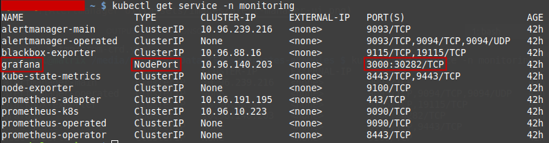
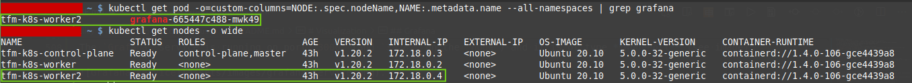
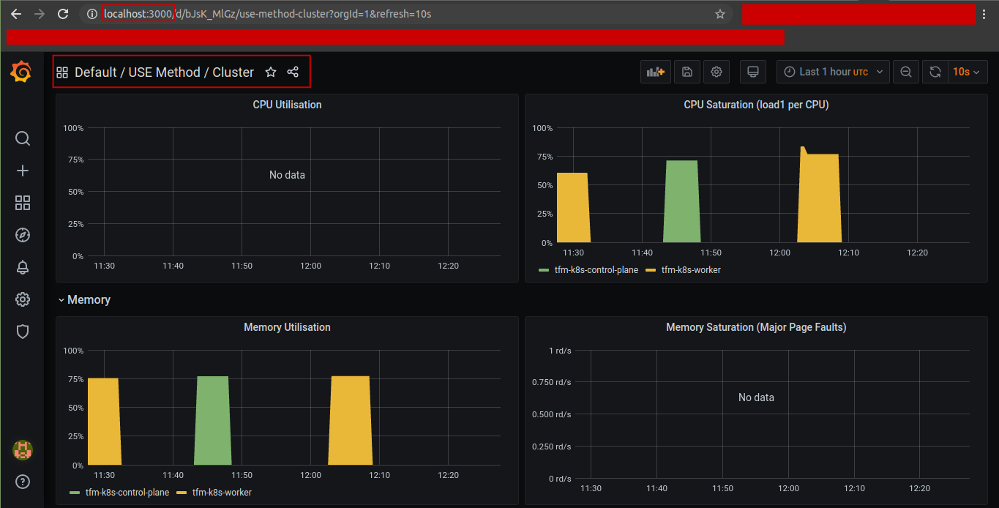
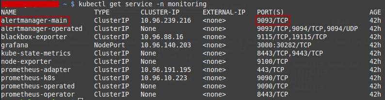
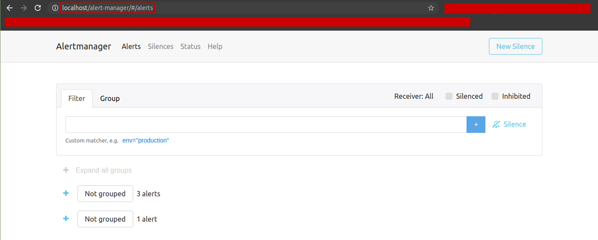

Prometheus is an open source, metrics-based monitoring system. It has a simple yet powerful data model and a query language that lets you analyse how your applications and infrastructure are performing.

Prometheus pulls metrics (key/value) and stores the data as time-series, allowing users to query data and alert in a real-time fashion. At given intervals, Prometheus will hit targets to collect metrics, aggregate data, show data, or even alert if some thresholds are met.

For instrumenting your own code, Prometheus has client libraries for applications written in Go, Java, Ruby, and Python. Other languages like C#, Node.js, or Rust have support as well, but they’re not official (yet). And for those `short-lived` applications like batch jobs, Prometheus can push metrics with a [PushGateway](https://github.com/prometheus/pushgateway).

> :bulb: **NOTE**
>
> Keep in mind that the preferable way to collect data is to pull metrics from an application’s endpoint.

# Architecture

Prometheus is composed of multiple components, each onea having a specific function. These are:


**The Prometheus Server**
Responsible for pulling and storing monitoring data from Exporter and providing a flexible query language (`PromQL`)

* **Retrieval**: sampling module
* **TSDB**: The storage module defaults to local storage as tsdb
* **HTTP Server**: Provide http interface query and panel, the default port is **9090**

It collects metrics in the form of time series data from nodes and stores them. The process of collecting metrics is referred to as scraping. Prometheus server does all the heavy lifting. All they have to do is expose their metrics in a way that the Prometheus server can access. They do this by exposing an HTTP endpoint, usually /metrics, which returns the full list of metrics (with accompanying label sets) and their values.

**Exporters/Jobs**
As mentioned earlier, clients simply have to expose their metrics for Prometheus to scrape, but this data has to be in a format that Prometheus understands. Prometheus stores data in a time series format, and only accepts data of that form. Metrics exposed by clients have to be in this format for Prometheus to scrape. However, time series formatted metrics do not typically spring forth from applications.

Instrumentation that produces these types of metrics often has to be manually added.This can be done in two ways:

1. We have **control of the source code** of the application whose metrics you want sent to Prometheus.
With very few lines of code, you can define and add your desired metrics using Prometheus' `client libraries` in a process called `direct instrumentation`.

2. We **do NOT have control of the source code** of the application/service we want to monitor.
In this case, `direct instrumentation` is not an option because we can’t use `client libraries` to export the metrics. In this case, we use [exporters](https://prometheus.io/docs/instrumenting/exporters/). Exporters are pieces of software that:
* Fetches statistics from another, non-Prometheus system
* Turn those statistics into Prometheus metrics, using a `client library`.
* Enables the `/metrics` endpoint, and have that URL display the system metrics

> :memo: NOTE
>
> A list of **exporters** can be found [here](https://prometheus.io/docs/instrumenting/exporters/).

> :bulb: INFO
>
> The **exporters** can be deployed alongside the applications whose metrics you're interested in.

For more details about **exporters** read [this](https://alanstorm.com/what-are-prometheus-exporters), [this](https://prometheus.io/docs/instrumenting/exporters/) and/or [this](https://www.metricfire.com/blog/first-contact-with-prometheus/).

**Clients libraries/SDKs**

The officially provided [`client libraries`](https://prometheus.io/docs/instrumenting/clientlibs/) include go, java, scala, python, ruby, and many other libraries developed by third parties, supporting nodejs, php, erlang, etc.

Client libraries handle all the essential details, such as bookkeeping or thread-safety, and sends out your metrics in a format that can be directly scraped by Prometheus, leaving the user with very little to do. Most libraries also provide certain metrics such as CPU usage and garbage collection statistics out of the box depending on the runtime environment and the library being used.

**PushGateway**

What if we have `short-lived` or batch jobs whose lifespan is shorter than the Prometheus scrape interval? In order to be able to collect those metrics, we must use the Prometheus `PushGateway`. Since these kinds of jobs may not exist long enough for Prometheus to scrape them, they can instead push their metrics to a Push Gateway, which acts as kind of a metric cache, holding them long enough so they can be scraped by Prometheus.

> :eyes: ATTENTION
>
> This method is mainly used for `service-level` metrics. For machine-level metrics, [`node exporter`](https://prometheus.io/docs/guides/node-exporter) is required.

Read [this](https://www.metricfire.com/blog/prometheus-pushgateways-everything-you-need-to-know/) for more info.

**Alertmanager**

The Prometheus Alertmanager allows you to define your own alerts on the collected metrics, so that you can be notified in case of any abnormalities or discrepancies in the data collected. Using various available integrations, the alert manager can be used to send alerts directly via SMS, email, Slack, PagerDuty, etc.

To know more, read [this](https://www.metricfire.com/blog/top-5-prometheus-alertmanager-gotchas/).

**Service Discovery**

Prometheus offers a variety of [service discovery options](https://github.com/prometheus/prometheus/tree/main/discovery) for discovering scrape targets, including [Kubernetes](https://prometheus.io/docs/prometheus/latest/configuration/configuration/#kubernetes_sd_config), [Consul](https://prometheus.io/docs/prometheus/latest/configuration/configuration/#consul_sd_config), and many others.

If you need to use a service discovery system that is not currently supported, your use case may be best served by Prometheus' [file-based service discovery](https://prometheus.io/docs/prometheus/latest/configuration/configuration/#file_sd_config) mechanism, which enables you to list scrape targets in a `JSON` file (along with metadata about those targets).

For more information, read [this](https://github.com/prometheus/prometheus/tree/main/discovery) or [this](https://prometheus.io/blog/2018/07/05/implementing-custom-sd/).

**Visualization**
The metrics collected by Prometheus are stored locally in a time series database. With the help of the [Prometheus Query Language](https://www.metricfire.com/blog/getting-started-with-promql/) (PromQL), a user can select and aggregate existing time series data in real time. The result can *mainly* be shown as graphs or tabular data in two places:
1. The integrated [Prometheus Expression Browser](https://www.metricfire.com/blog/prometheus-dashboards/#Prometheus-Expression-Browser) or,
2. An external visualization integration via the use of an HTTP API. The external integration of choice for Prometheus visualization would be [Grafana](https://prometheus.io/docs/visualization/grafana/).

# Installation

The Prometheus installation on Kubernetes can be rather complex. There are several installation approaches:
1. Manually create and apply (in the required order) all config files
2. Using an operator (Manager of Prometheus components)
3. Use a **Helm chart** or **manifests** to deploy the operator

We chose to install it via the **manifests**. All the [manifests](https://github.com/prometheus-operator/kube-prometheus/tree/main/manifests) applied are taken from the official [`kube-prometheus`](https://github.com/prometheus-operator/kube-prometheus).

> :memo: NOTE
>
> The manifests are stored in this repo on folder `observability/monitoring/prometheus/manifests`.

The [installation instructions](https://github.com/prometheus-operator/kube-prometheus#apply-the-kube-prometheus-stack) are the following:
```console
$ cd observability/monitoring/prometheus
$ kubectl apply -f manifests/setup
$ kubectl apply -f manifests/
```

Once installed, check the `monitoring` namespace and make sure the pods are running. **Prometheus** and **Grafana** should be up and running soon.

## Installed Kubernetes objects

We'll explore the Kubernetes objects created by the installation starting with the higher level objects and ending with the lowest level objects (i.e., pods).

For more details, check [this](https://www.youtube.com/watch?v=QoDqxm7ybLc).

### StatefulSets

From the installation, 2 **StatefulSets** are created (see image): one for the `Prometheus Server` (with 2 pods) and the other one for the `Alertmanager` (with 3 pods).


### Deployments

In this case, 5 **Deployments** are created (see image):


Those are:
* `deployment.apps/blackbox-exporter` (1 pod) (for more information, read [this](https://lapee79.github.io/en/article/monitoring-http-using-blackbox-exporter/), [this](https://devconnected.com/how-to-install-and-configure-blackbox-exporter-for-prometheus), [this](https://lyz-code.github.io/blue-book/devops/prometheus/blackbox_exporter/), [this](https://geekflare.com/monitor-website-with-blackbox-prometheus-grafana/) or [this](https://www.digitalocean.com/community/tutorials/how-to-install-prometheus-on-ubuntu-16-04)):

The [`blackbox exporter`](https://github.com/prometheus/blackbox_exporter) can monitor the external services on Prometheus. In order to achieve that, it generates metrics derived from probing endpoints to determine availability, response time, and more; all this over protocols like HTTP, HTTPS, DNS, TCP and ICMP.

> :memo: NOTE
> To test the deployment is working correctly, we'll use a `port-forward` exposing the HTTP port version of the corresponding pod:
> ```console
> $ kubectl port-forward -n monitoring svc/blackbox-exporter 19115
> ```
> We can also visit this service's home page for more details:
>
> 

`blackbox-exporter` service configuration:



If we issue a request to [http://localhost:19115/probe?target=google.com&module=http_2xx](http://localhost:19115/probe?target=google.com&module=http_2xx), we'll see the collected metrics for the probed `target=google.com`:


> :eyes:
> It is important to know the status of the probe: if the value of `probe_success` metrics is `1`, it means success. A `0` means failure.
> 

Adding a `debug=true` parameter will return debug information for that probe:


In case the user would like to make this service available outside the cluster, please check the ingress resource defined for that here: `ingress/prometheus/blackbox-exporter-ingress.yaml`.

* `deployment.apps/grafana` (1 pod):
for the `Grafana` service, which will be briefly discussed in further sections.

* `deployment.apps/kube-state-metrics` (1 pod):
for the `kube-state-metrics` service in order to collect metrics from Kubernetes *objects*. For more details on what it is or how to deploy it standalone, read [this](../kube-state-metrics/README.md).

* `deployment.apps/prometheus-adapter` (1 pod):

The [`Prometheus adapter`](https://github.com/kubernetes-sigs/prometheus-adapter) helps us to leverage the metrics collected by Prometheus and use them to make scaling decisions. These metrics are exposed by an API service and can be readily used by our **Horizontal Pod Autoscaling** object.

It pulls custom metrics from our Prometheus installation and then let the Horizontal Pod Autoscaler (HPA) use it to scale the pods up or down. The architecture would be the following:


For more details read [this](https://hackernoon.com/how-to-use-prometheus-adapter-to-autoscale-custom-metrics-deployments-p1p3tl0),
[this](https://www.metricfire.com/blog/prometheus-metrics-based-autoscaling-in-kubernetes/) or [this](https://itnext.io/autoscale-kubeless-functions-with-prometheus-adapter-f99507a23db6).

* `deployment.apps/prometheus-operator` (1 pod):

This deployment is responsible for creating the `Prometheus server` and `Alertmanager` objects, and related monitoring components.

The Prometheus Operator can automatically generate monitoring target settings based on Kubernetes label queries. Users can just refer to services and pods they want to monitor in Prometheus Operator’s manifest, and the Operator will take care of inserting appropriate Prometheus configuration for the Kubernetes auto-discovery.

To implement this functionality, Prometheus Operator introduces additional resources and abstractions designed as `Custom Resource Definitions` (CRD). These include:

* **Prometheus resource** that describes the desired state of the Prometheus deployment.
* **Service monitors** that describe and manage monitoring targets to be scraped by Prometheus. The Prometheus resource connects to ServiceMonitors using a `serviceMonitorSelector` field. This way Prometheus sees what targets (apps) have to be scraped.
* **Alert manager** resource to define, configure, and manage Prometheus alert manager.

The interaction of these resources can be observed on the following architecture diagram:


For more details, please consult [this](https://github.com/prometheus-operator/prometheus-operator), [this](https://github.com/prometheus-operator/prometheus-operator/blob/master/Documentation/user-guides/getting-started.md), [this](https://medium.com/kubernetes-tutorials/simple-management-of-prometheus-monitoring-pipeline-with-the-prometheus-operator-b445da0e0d1a) or [this](https://sysdig.com/blog/kubernetes-monitoring-prometheus-operator-part3/).

### DaemonSets

From the installation, 1 **DaemonSet** is created with the corresponding 3 pods (1 per node in the cluster)(see images).


The Prometheus [Node Exporter](https://prometheus.io/docs/guides/node-exporter/) exposes a wide variety of hardware and kernel related metrics.

For more details read [this](https://github.com/prometheus/node_exporter), [this](https://prometheus.io/docs/guides/node-exporter/) and [this](https://devconnected.com/complete-node-exporter-mastery-with-prometheus/#b_Node_Exporter_Prometheus).

### ConfigMaps

There are a lot of `ConfigMaps` created during the installation used for `Prometheus` itself, `Grafana`, etc:


These hold credentials, certificates, configurations (`Prometheus` rules), etc.

### Custom Resource Definitions (CRDs)

These are the CRDs creating during the installation:


For more information about CRDs, read [this](https://medium.com/velotio-perspectives/extending-kubernetes-apis-with-custom-resource-definitions-crds-139c99ed3477) and [this](https://kubernetes.io/docs/concepts/extend-kubernetes/api-extension/custom-resources/).

# Metric Types

> **TL;DR**
>
> For more information, please consult [this](https://prometheus.io/docs/concepts/metric_types/) and [this](https://tomgregory.com/the-four-types-of-prometheus-metrics/).

The Prometheus `client libraries` offer four core metric types:

1. Counter
2. Gauge
3. Histogram (https://prometheus.io/docs/practices/histograms/, https://www.robustperception.io/how-does-a-prometheus-histogram-work)
4. Summary

> :memo: NOTE
>
> The Prometheus server does not yet make use of the type information and flattens all data into untyped time series. This may change in the future.

**Counter**
A `counter` is a cumulative metric that represents a single *monotonically increasing counter* whose value can only increase or be reset to zero on restart. For example, you can use a counter to represent the number of requests served, tasks completed, or errors.

> :warning: WARNING
>
> Do not use a `counter` to expose a value that can decrease. For example, do not use a counter for the number of currently running processes; instead use a `gauge`.

**Gauge**
A `gauge` is a metric that represents a single numerical value that can arbitrarily go up and down.

Gauges are typically used for measured values like temperatures or current memory usage, but also "counts" that can go up and down, like the number of concurrent requests.

**Histogram**
A `histogram` samples observations (usually things like request durations or response sizes) and counts them in configurable buckets. It also provides a sum of all observed values

A histogram with a base metric name of **&lt;basename&gt;** exposes multiple time series during a scrape:

* cumulative counters for the observation buckets, exposed as **&lt;basename&gt;**_bucket{le="**&lt;upper inclusive bound&gt;**"}
* the total sum of all observed values, exposed as **&lt;basename&gt;**_sum
* the count of events that have been observed, exposed as **&lt;basename&gt;**_count (identical to **&lt;basename&gt;**_bucket{le="+Inf"} above)

For more details, read [this](https://prometheus.io/docs/concepts/metric_types/#histogram), [this](https://prometheus.io/docs/practices/histograms/), [this](https://www.robustperception.io/how-does-a-prometheus-histogram-work) and [this](https://grafana.com/blog/2020/06/23/how-to-visualize-prometheus-histograms-in-grafana/).

**Summary**
Similar to a histogram, a `summary` samples observations (usually things like request durations and response sizes). While it also provides a total count of observations and a sum of all observed values, it calculates configurable quantiles over a sliding time window.

## Prometheus metrics compatibility

There are a number of libraries and servers which help in exporting existing metrics from third-party systems as Prometheus metrics. This is useful for cases where it is not feasible to instrument a given system with Prometheus metrics directly (for example, HAProxy or Linux system stats). For more details, read [this](https://prometheus.io/docs/instrumenting/exporters/#software-exposing-prometheus-metrics).

The [Prometheus exposition format](https://prometheus.io/docs/instrumenting/exposition_formats/) is omnipresent these days. It simply displays metrics line-by-line in a text-based format, and supports the `histogram`, `gauge`, `counter` and `summary` metric types.

### The standardization: OpenMetrics

According to [this] (https://sysdig.com/blog/openmetrics-is-prometheus-unbound/) blog post,

> Yes, *politics* is part of the world: traditional vendors may want to avoid lock-in or to appear to support external (or competing) products. They usually prefer to use official standards only, and that’s perfectly fine.

for practical/industry reasons, a standard for metrics format might be needed.

The way to achieve this is:
> to create an official open standard: a set of **vendor neutral guidelines**, with **no brand, available to all to read and implement** in order to **foster cooperation to solve a shared problem**.

The answer: [OpenMetrics](https://github.com/OpenObservability/OpenMetrics).

`OpenMetrics` a specification built upon and carefully extending `Prometheus exposition format` in almost 100% backwards-compatible ways. `OpenMetrics` has been regularly worked on since June 2017. The goal is to take the Prometheus exposition text format which is a defacto standard, and make it into a cleaner vendor-neutral standard.

> :eyes: NOTE
>
> While the **OpenMetrics** text format is very similar to the Prometheus text format, they are not the same thing.

For more details, please read [this](https://sysdig.com/blog/openmetrics-is-prometheus-unbound/), [this](https://github.com/OpenObservability/OpenMetrics/blob/main/specification/OpenMetrics.md) and [this](https://www.robustperception.io/openmetrics-is-released).

# Pull vs. Push

Monitoring systems generally fall into two categories: those where services `push metrics` to the monitoring system and those where the monitoring system `pulls metrics` from services.

Prometheus falls primarily into the `pull` category as it is a descendant of the `Borgmon` monitoring system. `Borgmon` was used to monitor the work scheduling system called `Borg` at Google which later became `Kubernetes`.

There's an [ongoing debate](https://thenewstack.io/exploring-prometheus-use-cases-brian-brazil/) regarding the *pull vs. push* and we'll briefly talk about it here.

In favor of the `pull` approach, Julius Voltz (one of Prometheus creator) states:

> A `pull` approach usually requires less configuration and it also makes your monitoring setup more flexible. With `pull`, you can just run a copy of production monitoring on your laptop to experiment with it. It also allows you just fetch metrics with some other tool or inspect metrics endpoints manually.
>
> To get high availability, `pull` allows you to just run two identically configured Prometheus servers in parallel. And lastly, if you have to move the endpoint under which your monitoring is reachable, a `pull` approach does not require you to reconfigure all of your metrics sources.

In favor of the `push` approach, it is easier to implement Replication To Different Ingestion Points. This means that since it is all initiated by the client itself it becomes easier to replicate the same traffic to different servers. You just need to transmit it to more than one target IP address.


Also, it is easier to Mmdel Shortlived Batch-Jobs and all of the receivers will get the same exact data. If you would spin up two different instances of Prometheus (which uses the HTTP pull method) then they most likely will not have the same exact data.

For more information check [this](https://prometheus.io/blog/2016/07/23/pull-does-not-scale-or-does-it/), [this](https://www.youtube.com/watch?v=h4Sl21AKiDg&t=723s) and [this](https://giedrius.blog/2019/05/11/push-vs-pull-in-monitoring-systems/).

# Prometheus rules

Prometheus supports two types of rules which may be configured and then evaluated at regular intervals:

* [Recording rules](https://www.prometheus.io/docs/prometheus/2.17/configuration/recording_rules/) are for pre-calculating frequently used or computationally expensive queries. The results of those rules are saved into their own time series.
* [Alerting rules](https://www.prometheus.io/docs/prometheus/2.17/configuration/alerting_rules/) on the other hand enable you to specify the conditions that an alert should be fired to an external service like `Slack`. These are based on `PromQL` queries.

To include rules in Prometheus, create a file containing the necessary rule statements and have Prometheus load the file via the `rule_files` field in the [Prometheus configuration](https://www.prometheus.io/docs/prometheus/2.17/configuration/configuration/). Rule files use YAML.

For more information, read [this](https://www.devopsschool.com/blog/recording-rules-and-alerting-rules-exmplained-in-prometheus/) and [this](https://prometheus.io/docs/practices/rules/).

## Recording rules

Recording rules allow you to precompute frequently needed or computationally expensive expressions and save their result as a new set of time series. Querying the precomputed result will then often be much faster than executing the original expression every time it is needed. This is especially useful for dashboards, which need to query the same expression repeatedly every time they refresh.

Recording and alerting rules exist in a rule group. Rules within a group are run sequentially at a regular interval. The names of recording and alerting rules must be [valid metric names](https://www.prometheus.io/docs/concepts/data_model/#metric-names-and-labels).

Some `recording rules` examples would be the following:
```yaml
Recording Rule Example 1
================================
# Aggregating up requests per second that has a path label:
- record: instance_path:requests:rate5m
  expr: rate(requests_total{job="myjob"}[5m])

- record: path:requests:rate5m
  expr: sum without (instance)(instance_path:requests:rate5m{job="myjob"})

Recording Rule Example 2
================================
# Calculating the average query rate across instances and paths is done using the avg() function:

- record: job:request_latency_seconds_count:avg_rate5m
  expr: avg without (instance, path)(instance:request_latency_seconds_count:rate5m{job="myjob"})
```

For more details read [this](https://prometheus.io/docs/prometheus/latest/configuration/recording_rules/) and [this](https://www.devopsschool.com/blog/recording-rules-and-alerting-rules-exmplained-in-prometheus/).

## Alerting rules

Alerting rules allow you to define alert conditions based on Prometheus expression language expressions and to send notifications about firing alerts to an external service. Whenever the alert expression results in one or more vector elements at a given point in time, the alert counts as active for these elements' label sets.

Prometheus's alerting rules are good at figuring what is broken right now, but they are not a fully-fledged notification solution. Another layer is needed to add summarization, notification rate limiting, silencing and alert dependencies on top of the simple alert definitions. In Prometheus's ecosystem, the Alertmanager takes on this role. Thus, Prometheus may be configured to periodically send information about alert states to an Alertmanager instance, which then takes care of dispatching the right notifications.

Alerting rules are configured in Prometheus in the same way as `recording rules`. Some `alerting rules` examples would be the following:
```yaml
Example of prometheus alerting rules 1
==============================================

groups:
- name: example
  rules:
  - alert: HighRequestLatency
    expr: job:request_latency_seconds:mean5m{job="myjob"} > 0.5
    for: 10m
    labels:
      severity: page
    annotations:
      summary: High request latency


Example of prometheus alerting rules 2
==============================================

groups:
- name: example
  rules:

  # Alert for any instance that is unreachable for >5 minutes.
  - alert: InstanceDown
    expr: up == 0
    for: 5m
    labels:
      severity: page
    annotations:
      summary: "Instance {{ $labels.instance }} down"
      description: "{{ $labels.instance }} of job {{ $labels.job }} has been down for more than 5 minutes."

  # Alert for any instance that has a median request latency >1s.
  - alert: APIHighRequestLatency
    expr: api_http_request_latencies_second{quantile="0.5"} > 1
    for: 10m
    annotations:
      summary: "High request latency on {{ $labels.instance }}"
      description: "{{ $labels.instance }} has a median request latency above 1s (current value: {{ $value }}s)"
```

> :eyes: NOTE
>
> A collection of `alerting rules` can be found [here](https://awesome-prometheus-alerts.grep.to/rules.html)

For more information read [this](https://prometheus.io/docs/prometheus/latest/configuration/alerting_rules/) and [this](https://www.devopsschool.com/blog/recording-rules-and-alerting-rules-exmplained-in-prometheus/).

## Checking/testing rules

To quickly check whether a rule file is syntactically correct without starting a Prometheus server, install and run Prometheus's `promtool` command-line utility tool:

The instructions for this would be:
```console
$ go get github.com/prometheus/prometheus/cmd/promtool
$ promtool check rules /path/to/example.rules.yml
```

When the file is syntactically valid, the checker prints a textual representation of the parsed rules to standard output and then exits with a `0` return status.

If there are any syntax errors or invalid input arguments, it prints an error message to standard error and exits with a `1` return status.

> :eyes: INFO
>
> `promtool` can also be used to perform **Unit Tests** on your rules. For more information read [this](https://prometheus.io/docs/prometheus/latest/configuration/unit_testing_rules), [this](https://ish-ar.io/prometheus-alert-rules-unit-testing/) and [this](https://www.robustperception.io/unit-testing-rules-with-prometheus)

# Prometheus Data Storage

Prometheus has a sophisticated local storage subsystem. For indexes, it uses [LevelDB](https://github.com/google/leveldb). For the bulk sample data, it has its own custom storage layer, which organizes sample data in chunks of constant size (1024 bytes payload). These chunks are then stored on disk in one file per time series.

By default, Prometheus store data on SSD/HDD, but it can be integrated with Remote Storage Systems (i.e., relational DBs, etc.) and the data is stored in a `Custom Time Series Format`.

For more advanced configuration setttings, please check [this](https://prometheus.io/docs/prometheus/latest/storage). To dive deeper into the topic, check out the following:
* The Prometheus Time Series Database
    * [The Prometheus Time Series Database](https://www.youtube.com/watch?v=HbnGSNEjhUc)
    * [TSDB format](https://github.com/prometheus/prometheus/blob/release-2.26/tsdb/docs/format/README.md)
    * [Prometheus storage: technical terms for humans](https://valyala.medium.com/prometheus-storage-technical-terms-for-humans-4ab4de6c3d48)
* Configuring Prometheus for High Performance
    * [Configuring Prometheus for High Performance](https://www.youtube.com/watch?v=hPC60ldCGm8)
    * [How to Scale Prometheus for Kubernetes](https://epsagon.com/development/how-to-scale-prometheus-for-kubernetes/)

Prometheus can be integrated with `Remote Endpoints and Storage`. The [remote write](https://prometheus.io/docs/operating/configuration/#remote_write) and [remote read](https://prometheus.io/docs/operating/configuration/#remote_read) features of Prometheus allow transparently sending and receiving samples. This is primarily intended for long term storage. It is recommended that you perform [careful evaluation of any solution in this space](https://prometheus.io/docs/operating/integrations/#remote-endpoints-and-storage) to confirm it can handle your data volumes.

As mentioned before there are a lot of tooling available to enhance a Prometheus-based monitoring solution. A detailed analysis of these tools and solutions is out of the scope of this documentation. Nonetheless, we'll briefly mention some of those here.

**Databases**
* [M3DB](https://m3db.io/)
    * [Prometheus integration](https://m3db.io/docs/integrations/prometheus/)
    * [M3db cluster as a Prometheus long term storage](https://medium.com/@sayfeddinehammemi/m3db-cluster-as-a-prometheus-long-term-storage-dfbbb1f6aeb8)
* [InfluxDB](https://www.influxdata.com/)
    * [InfluxDB repo](https://github.com/influxdata/influxdb)
    * [Connect Prometheus to TSDB for InfluxDB](https://www.alibabacloud.com/help/doc-detail/116300.htm)
* [VictoriaMetrics](https://victoriametrics.com/)
    * [VictoriaMetrics's docs](https://victoriametrics.github.io/)
    * [VictoriaMetrics: how to migrate data from Prometheus](https://medium.com/@romanhavronenko/victoriametrics-how-to-migrate-data-from-prometheus-d44a6728f043)
    * [VictoriaMetrics's GitHub repo](https://github.com/VictoriaMetrics/VictoriaMetrics/)
* [OpenEBS](https://openebs.io/)
    * [OpenEBS's docs](https://docs.openebs.io/v150/)
    * [Using OpenEBS as TSDB for Prometheus](https://docs.openebs.io/v150/docs/next/prometheus.html)
    * [Using OpenEBS as the TSDB for Prometheus](https://blog.mayadata.io/openebs/using-openebs-as-the-tsdb-for-prometheus)

**High Availability**
* [Thanos](https://thanos.io/)
    * [Integrations](https://thanos.io/tip/thanos/integrations.md/)
    * [Thanos GitHub's repo](https://github.com/thanos-io/thanos)
    * [Prometheus Federation with Thanos](https://coralogix.com/log-analytics-blog/prometheus-federation-with-thanos-how-does-thanos-work/)
    * [Thanos: Prometheus at Scale](https://www.improbable.io/blog/thanos-prometheus-at-scale)
* [Cortex](https://cortexmetrics.io/)
    * [How Prometheus Monitoring works | Prometheus Architecture explained (min 20:00)](https://www.youtube.com/watch?v=h4Sl21AKiDg)
    * [Cortex's GitHub repo](https://github.com/cortexproject/cortex)
    * [Cortex: a multi-tenant, horizontally scalable Prometheus-as-a-Service](https://www.cncf.io/blog/2018/12/18/cortex-a-multi-tenant-horizontally-scalable-prometheus-as-a-service/)
    * [Kubernetes Monitoring at Scale with Prometheus and Cortex](https://platform9.com/blog/kubernetes-monitoring-at-scale-with-prometheus-and-cortex/)
    * [Cortex Vs Thanos vs Uber's M3](https://www.reddit.com/r/kubernetes/comments/e07mtp/cortex_vs_thanos_vs_ubers_m3_which_is_one_better/)

**Managed Prometheus solutions**
* [Logz.io](https://logz.io/)
    * [Early Access for Logz.io’s Prometheus-as-a-Service](https://logz.io/blog/prometheus-as-a-service/).
    * [Logz.io infrastructure monitoring](https://logz.io/platform/infrastructure-monitoring/)
    * [Why We Chose the M3DB Data Store for Logz.io Prometheus-as-a-Service](https://logz.io/blog/m3db-prometheus-as-a-service/)
* [Metricfire](https://www.metricfire.com/)
    * [Metricfire hosted Prometheus](https://www.metricfire.com/hosted-prometheus/)
    * [Monitoring Kubernetes tutorial: using Grafana and Prometheus](https://medium.com/the-metricfire-blog/monitoring-kubernetes-tutorial-using-grafana-and-prometheus-f106091534fb)

# PromQL?

The query language used in Prometheus is called [`PromQL`](https://prometheus.io/docs/prometheus/latest/querying/basics/) (Prometheus Query Language). The data can either be viewed as a graph, as tabled data, or in external systems such as `Grafana`, `Zabbix` and others.

`PromQL` is designed for building powerful yet simple queries for graphs, alerts or derived time series (aka [recording rules](https://prometheus.io/docs/prometheus/latest/configuration/recording_rules/)). It is designed from scratch and has zero common grounds with other query languages used in time series databases such as [SQL in TimescaleDB](https://www.timescale.com/), [InfluxQL](https://docs.influxdata.com/influxdb/v1.7/query_language/) or [Flux](https://github.com/influxdata/flux).

This allowed creating a clear language for typical `TSDB` queries. But it has a cost — beginners usually need to spend a few hours reading the [official PromQL docs](https://prometheus.io/docs/prometheus/latest/querying/basics/) before they understand how it works.

For more information please check:
* [PromQL tutorial for beginners and humans](https://valyala.medium.com/promql-tutorial-for-beginners-9ab455142085)
* [Introduction to PromQL, the Prometheus Query Language](https://grafana.com/blog/2020/02/04/introduction-to-promql-the-prometheus-query-language/)
* [PromQL for humans](https://timber.io/blog/promql-for-humans/)
* [Getting started with PromQL](https://www.metricfire.com/blog/getting-started-with-promql/)
* [PromQL Example Queries](https://sbcode.net/prometheus/example-queries/)

# Visualization

`Prometheus`, `Grafana`, and `Alertmanager` dashboards can be accessed quickly using `kubectl port-forward` or be exposed outside the cluster via ingress resources (see [here](https://github.com/prometheus-operator/kube-prometheus#access-the-dashboards)).

## Prometheus Expression Browser

The Prometheus service is running on port `9090` but is of type **ClusterIP** (see image) so we need to make it accesible from outside the cluster.



Exposing `prometheus-k8s` via `kubectl port-forward` (visit [localhost:9090/](localhost:9090/)),
```console
$ kubectl port-forward -n monitoring service/prometheus-k8s 9090
```


> :warning: WARNING
>
> Exposing the Prometheus Expression Browser via an `ingress resource` needs some tweaks which, didn't were looked into dept here. For more details about this, please check:
> * https://stackoverflow.com/questions/59537655/prometheus-dashboard-exposed-over-ingress-controller
> * https://stackoverflow.com/questions/63227961/the-problem-about-expose-prometheus-web-ui-through-nginx-ingress-controller
> * https://github.com/prometheus-operator/prometheus-operator/blob/master/Documentation/user-guides/exposing-prometheus-and-alertmanager.md

## Grafana

[Grafana](https://grafana.com/) allows you to query, visualize, alert on and understand your metrics no matter where they are stored. Create, explore, and share dashboards with your team and foster a data driven culture:

* **Visualize:** Fast and flexible client side graphs with a multitude of options. Panel plugins offer many different ways to visualize metrics and logs.
* **Dynamic Dashboards:** Create dynamic & reusable dashboards with template variables that appear as dropdowns at the top of the dashboard.
* **Explore Metrics:** Explore your data through ad-hoc queries and dynamic drilldown. Split view and compare different time ranges, queries and data sources side by side.
* **Explore Logs:** Experience the magic of switching from metrics to logs with preserved label filters. Quickly search through all your logs or streaming them live.
* **Alerting:** Visually define alert rules for your most important metrics. Grafana will continuously evaluate and send notifications to systems like Slack, PagerDuty, VictorOps, OpsGenie.
* **Mixed Data Sources:** Mix different data sources in the same graph! You can specify a data source on a per-query basis. This works for even custom datasources.

The `Grafana` service is running on port `3000` (and `30282` on the `node`) and it is of type **NodePort** (see image):

.

It can be accessed at **&lt;node-ip&gt;:&lt;node-port&gt;**. Next, get obtain such info:



In our scenario, we can access Grafana at **&lt;172.18.0.4&gt;:&lt;30282&gt;**. On the other hand, a `NodePort` service creates a `ClusterIP` service underneath. Therefore, we can make it accesible from outside the cluster.

Exposing `grafana` via `kubectl port-forward` (visit [localhost:3000](localhost:3000)),
```console
kubectl --namespace monitoring port-forward svc/grafana 3000
```



> :eyes: NOTICE
>
> The screenshot shows an advanced monitoring indicator: the [`USE Method`](http://www.brendangregg.com/usemethod.html).
>
> For the dashboards configuration details seach for "USE Method / Cluster" and "USE Method / Node" on [`observability/monitoring/prometheus/manifests/grafana-dashboardDefinitions.yaml`](../../../observability/monitoring/prometheus/manifests/grafana-dashboardDefinitions.yaml)

> :warning: WARNING
>
> If we attempt to expose `Grafana` with an `ingress resource` (available at [`ingress/prometheus/grafana-ingress.yaml`](../../../ingress/prometheus/grafana-ingress.yaml)) we run into the following:
> 
> This requires a little more configuration which is outside the scope of these examples. For more information check this:
> * https://github.com/prometheus-community/helm-charts/issues/201
> * https://community.grafana.com/t/how-to-configure-grafana-behind-reverse-proxy-ingress-nginx-controller/35937
> * https://grafana.com/tutorials/run-grafana-behind-a-proxy/

For more information check these:
* https://prometheus.io/docs/visualization/grafana/
* https://yitaek.medium.com/practical-monitoring-with-prometheus-grafana-part-ii-5020be20ebf6
* https://docs.particular.net/samples/logging/prometheus-grafana/
* https://blog.cloudthat.com/integration-and-visualization-of-prometheus-metrics-in-grafana/

## Alert manager UI

The [Alertmanager](https://prometheus.io/docs/alerting/latest/alertmanager/) handles alerts sent by client applications such as the Prometheus server. It takes care of deduplicating, grouping, and routing them to the correct receiver integration such as email, `PagerDuty`, or `OpsGenie`. It also takes care of silencing and inhibition of alerts.

The `Alertmanager` service is running on port `9093` but is of type **ClusterIP** (see image) so we need to make it accesible from outside the cluster.



Exposing `alertmanager-main` via `kubectl port-forward` (visit [localhost:9093](localhost:9093)),
```console
kubectl --namespace monitoring port-forward svc/alertmanager-main 9093
```

or exposing it via an `ingress resource` (visit [localhost/alert-manager](localhost/alert-manager)):

.

The `ingress resource` used can be found at [`ingress/prometheus/alert-manager-ingress.yaml`](../../../ingress/prometheus/alert-manager-ingress.yaml)

For more information check these:
* [Prometheus: Alertmanager Web UI alerts Silence](https://itnext.io/prometheus-alertmanager-web-ui-alerts-silence-2d34fbf2d252)
* [karma: Alert dashboard for Prometheus Alertmanager](https://karma-dashboard.io/)

# Other References:
* [Youtube: How Prometheus Monitoring works | Prometheus Architecture explained](https://www.youtube.com/watch?v=h4Sl21AKiDg)
* [What is Prometheus?](https://www.metricfire.com/blog/what-is-prometheus/)
* [Robust Perception blog](https://www.robustperception.io/blog)
* [Prometheus: Up & Running](https://www.oreilly.com/library/view/prometheus-up/9781492034131/ch01.html)
* https://www.programmersought.com/article/16474076685/