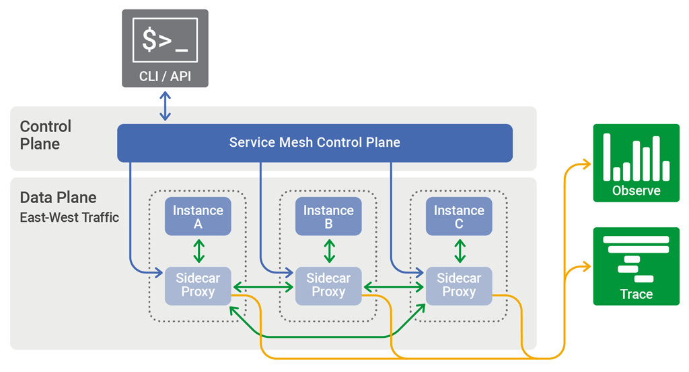

# Service meshes

In software architecture, a service mesh is a dedicated infrastructure layer for facilitating service-to-service communications between services or microservices, using a proxy (often as a sidecar).

A service mesh ensures that communication among containerized and often ephemeral application infrastructure services is fast, reliable, and secure. The mesh provides critical capabilities including service discovery, load balancing, encryption, observability, traceability, authentication and authorization, and support for the circuit breaker pattern.

The part of a service mesh application that manages the network traffic between instances is called the **data plane**. Generating and deploying the configuration that controls the data plane’s behavior is done using a separate **control plane**. The **control plane** typically includes, or is designed to connect to, an API, a command‑line interface, and a graphical user interface for managing the app.

The following is the architecture/topology of a generic service mesh:

# Istio

> **TL;DR**
>
> For a **hands-on** approach, please check the [examples and tests](istio/README.md) in this repo.

Istio is designed for extensibility and meets diverse deployment needs. It does this by intercepting and configuring mesh traffic. From the official website, Istio's control plane functionalities include:

> * Automatic load balancing for HTTP, gRPC, WebSocket, and TCP traffic.
> * Fine-grained control of traffic behavior with rich routing rules, retries, failovers, and fault injection.
> * A pluggable policy layer and configuration API supporting access controls, rate limits and quotas.
> * Automatic metrics, logs, and traces for all traffic within a cluster, including cluster ingress and egress.
> * Secure service-to-service communication in a cluster with strong identity-based authentication and authorization.

If you're still curious about what **Istio** is and what is is not, please check [Istio FAQ](https://istio.io/latest/faq/) for more information.

# Linkerd

> :warning SPOILER
>
> This project does **NOT** include [tests and examples](linkerd/README.md) with Linkerd.

From the [official website](https://linkerd.io/), **Linkerd** is:
> Ultra light, ultra simple, ultra powerful. Linkerd adds security, observability, and reliability to Kubernetes, without the complexity. CNCF-hosted and 100% open source.

Linkerd is a service mesh. It adds observability, reliability, and security to Kubernetes applications without code changes. For example, Linkerd can monitor and report per-service success rates and latencies, can automatically retry failed requests, and can encrypt and validate connections between services, all without requiring any modification of the application itself.

For more information, please check [Linkerd FAQ](https://linkerd.io/faq/).

# Other References:
* (Microservice Challenges, Envoy, etc.) https://www.magalix.com/blog/what-is-a-service-mesh
* https://www.nginx.com/blog/what-is-a-service-mesh/
* https://www.redhat.com/en/topics/microservices/what-is-a-service-mesh