# Architecture

* https://istio.io/latest/docs/ops/deployment/architecture/
* https://www.infracloud.io/blogs/service-mesh-comparison-istio-vs-linkerd/
* https://www.alibabacloud.com/blog/architecture-analysis-of-istio-the-most-popular-service-mesh-project_597010#:~:text=Envoy's%20discovery%20services%20rely%20on,service%20registry%20to%20discover%20services.

(has an istio architecture image) https://sysdig.com/blog/monitor-istio/


https://www.infracloud.io/blogs/service-mesh-comparison-istio-vs-linkerd/
* Envoy
* Citadel
* Gallery
* etc.

## Control Plane

### Istiod and Service Discovery

https://istio.io/latest/docs/concepts/traffic-management/#introducing-istio-traffic-management

### Istiod as CA

## Data Plane

Istio as CA allows for later mTLS

* (Demystifying Istio's Sidecar Injection Model) https://istio.io/latest/blog/2019/data-plane-setup/

# Installation
<a id="istio-installation"></a>

The first step is to download Istio from the [release page](https://github.com/istio/istio/releases) and download the installation file for your OS, or download and extract the latest release automatically (Linux or macOS).

> :memo: INFO
>
> In these examples Istio **v1.9.0** is the one used.

Once we have extracted the content and navigated inside the folder, there are a couple of folders of interest:

* `bin/` (which contains the [`istioctl`](https://istio.io/latest/docs/reference/commands/istioctl/) client binary)
* `samples/` (having manifests for several `istio-enabled` test applications)

Next, on the terminal, we need to add `istioctl` to our PATH with something like:

```console
$ export PATH=$PWD/bin:$PATH
```

or adding that to the `~/.bashrc` file on our HOME folder.

## Istio install

There several configuration profiles we can user for our `Istio` installation depending on our needs: `default`, `demo`, `minimal`, `remote`, `empty` and `preview`. For more details and proper scenarios for these profiles, please read the [official docs](https://istio.io/latest/docs/setup/additional-setup/config-profiles/) regarding this.

As a quick reference, the components marked as **✔** are installed within each profile:

|                            | default | demo | minimal | remote | empty | preview |
|:--------------------------:|:-------:|:----:|:-------:|:------:|:-----:|:-------:|
| Core components            |         |      |         |        |       |         |
|       istio-egressgateway  |         | ✔    |         |        |       |         |
|       istio-ingressgateway | ✔       | ✔    |         |        |       | ✔       |
|       istiod               | ✔       | ✔    | ✔       |        |       | ✔       |

> :eyes:
>
> For our examples, the profile selected is `demo`, as it’s selected to have a good set of defaults for testing, but there are other profiles for production or performance testing.

To install/enable Istio on your cluster:

```console
$ istioctl install --set profile=demo -y
```

Here we can see the components installed:

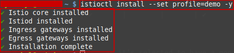

In order to
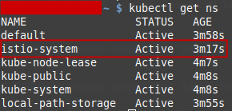

Inside the `istio-system` namespace, we can see a pod for [`istiod`](https://istio.io/latest/blog/2020/istiod/) and [`istio-ingressgateway`](https://istio.io/latest/docs/tasks/traffic-management/ingress/ingress-control/):
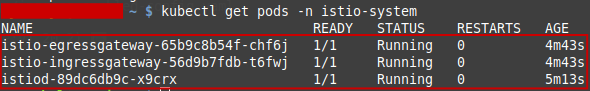

For more information about `Gateway` on `Istio`, please check [this](https://istio.io/latest/docs/reference/config/networking/gateway/) and [this](https://www.alibabacloud.com/blog/north-south-traffic-management-of-istio-gateways-with-answers-from-service-mesh-experts_596658).

## `istioctl analyze`

`istioctl analyze` is a diagnostic tool that detects potential issues with your Istio configuration, as well as gives general insights to improve your configuration. It can run against a live cluster or a set of local configuration files. It can also run against a combination of the two, allowing you to catch problems before you apply changes to a cluster.

> :memo:
>
> For more details on how to use and the capabilities of `istioctl analyze`, please check [this](https://istio.io/latest/docs/ops/diagnostic-tools/istioctl-analyze/) and [this](https://istio.io/latest/blog/2019/introducing-istioctl-analyze/).

We can analyze your current live Kubernetes cluster by running:

```console
$ istioctl analyze
```

We get the following:

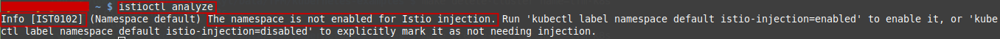

This means we forgot to enable Istio injection (a very common issue). In order to fix it we can do the following:

```console
$ kubectl label namespace default istio-injection=enabled
```

This adds a namespace label to instruct Istio to automatically inject Envoy sidecar proxies when you deploy your application later. If we run our analysis again, we see that everything is fine now:

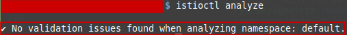

# Istio Ingress Gateway

Along with support for Kubernetes Ingress, Istio offers another configuration model, [Istio Gateway](https://istio.io/latest/docs/reference/config/networking/gateway/). A `Gateway` provides more extensive customization and flexibility than `Ingress`, and allows Istio features such as monitoring and route rules to be applied to traffic entering the cluster

For a step by step tutorial on how to deploy an Istion Ingress Gateway resource, please follow [these instructions](https://istio.io/latest/docs/tasks/traffic-management/ingress/ingress-control/).

> :memo:
>
> For another example of deployment of `Istio Ingress Gateway`, please check the Bookinfo deployment instructions at [`deployments/bookinfo/README.md`](../../deployments/bookinfo/README.md#deploy-gateway-bookinfo).

# cert-manager

https://istio.io/latest/blog/2019/custom-ingress-gateway/
https://cert-manager.io/docs/usage/istio/
https://www.programmersought.com/article/51784265469/
https://stackoverflow.com/questions/56592446/istio-gateway-cert-manager-letsencrypt-certificate
https://www.youtube.com/watch?v=QlQyqCaTOh0

# Addons

Once we have Istio installed, we can enable the shipped addons (mainly related with Telemetry) with the following command:

```console
$ kubectl apply -f ~/istio-1.9.0/samples/addons
```

This deploys the following addons:
* Prometheus
* Grafana
* Jaeger
* Kiali

For more information about which integrations/addons can be put in place, please check [this](https://istio.io/latest/docs/ops/integrations/).

## Prometheus

https://istio.io/latest/docs/ops/integrations/prometheus/

* https://istio.io/latest/docs/ops/integrations/prometheus/
* https://www.istiobyexample.dev/prometheus
* https://istio.io/latest/docs/tasks/observability/metrics/using-istio-dashboard/

## Grafana

https://istio.io/latest/docs/ops/integrations/grafana/


Istio Dashboards                           |         Istio Performance Dashboard
:-----------------------------------------:|:-------------------------:
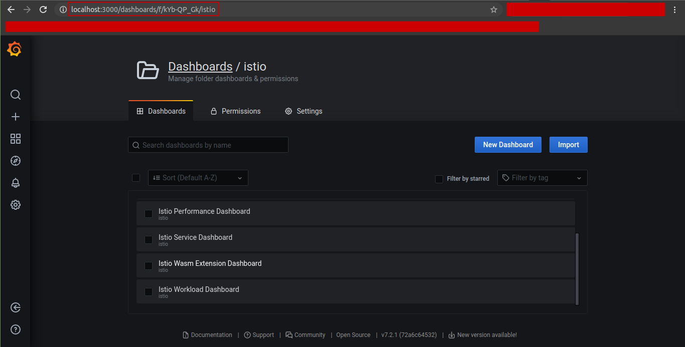  |  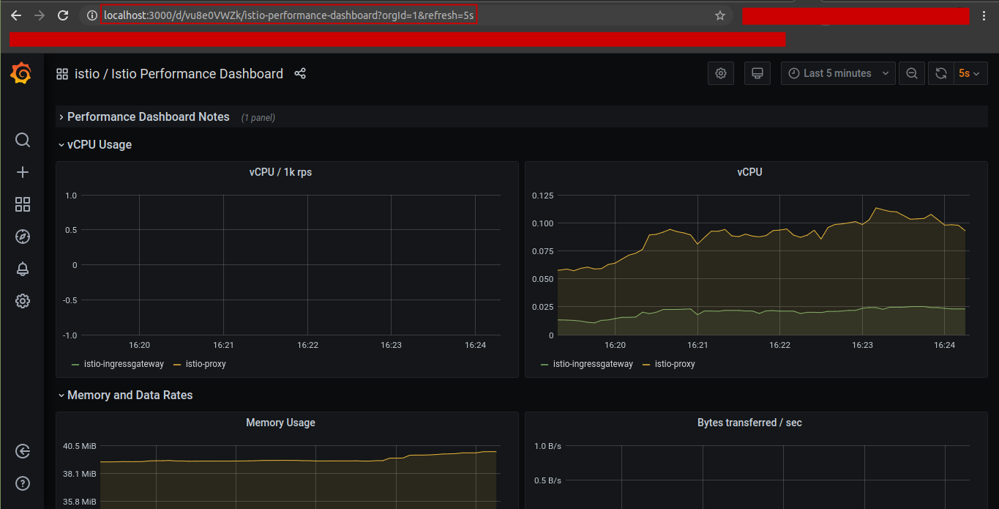


Istio Control Plane Dashboard             |         Istio Workload Dashboard
:----------------------------------------:|:-------------------------:
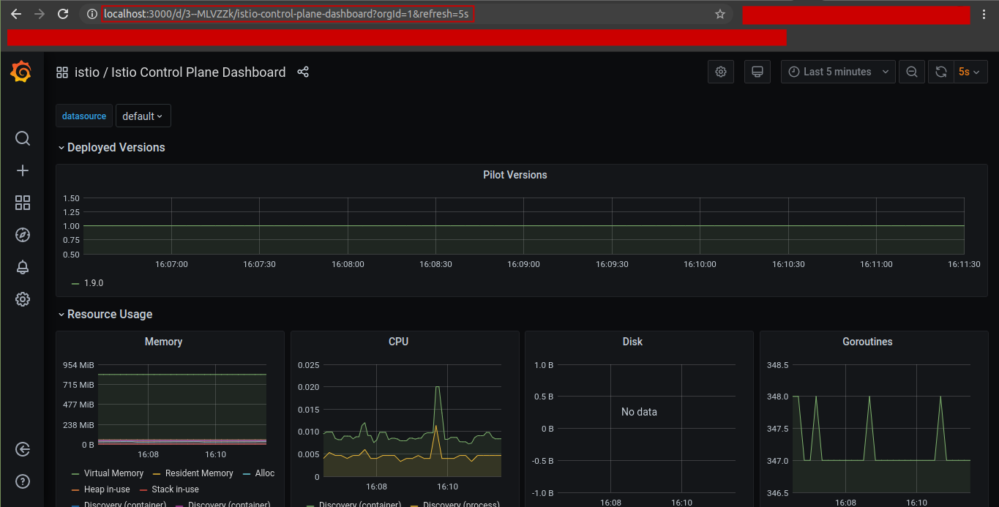  |  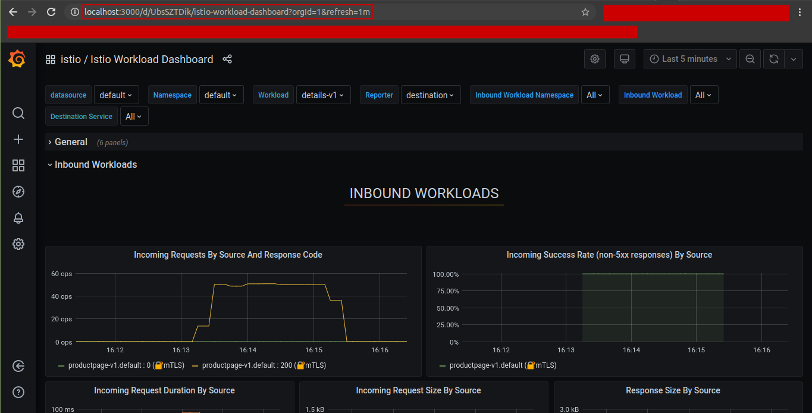

## Kiali

> :eyes:
>
> There's a way to integrate Distributed Tracing capabilities in Kiali. For configuration details, please read [this](https://kiali.io/documentation/latest/distributed-tracing/).

> :eyes:
>
> Another cool feature of Kiali is the `Graph Traces`. For this feature, we need to integrate Distributed Tracing into Kiali. This allows os to correlate the tracing information with the Kiali's graph view. For more information, whatch [this](https://www.youtube.com/watch?v=z7cZDPV9Ge0).


https://kiali.io/documentation/v1.24/faq/


* https://istio.io/latest/docs/tasks/observability/kiali/

kubectl port-forward svc/kiali -n istio-system 20001

Kiali Home                                 |         Kiali Graph
:-----------------------------------------:|:-------------------------:
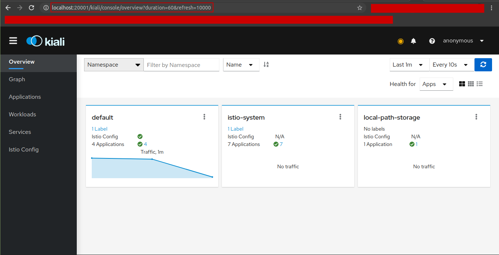  |  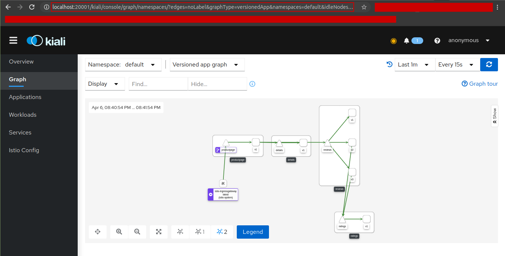


## Jaeger

Jaeger UI Home      |      Jaeger Trace/Span Waterfal Graph
:------------------:|:-------------------------:
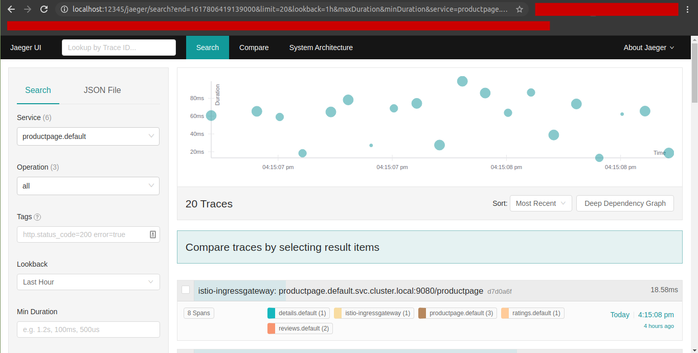  |  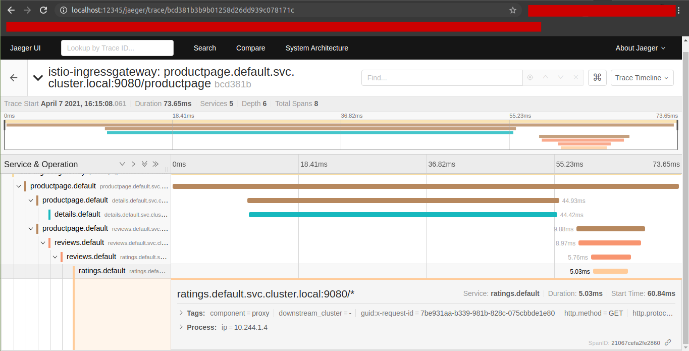


https://kiali.io/documentation/v1.12/distributed-tracing/


to integrate with zipkinf, check this https://istio.io/latest/docs/ops/integrations/zipkin/

# Istio-enabled application: Requirements

There are some implications of Istio’s sidecar model that may need special consideration when deploying an Istio-enabled application. This document describes these application considerations and specific requirements of Istio enablement.

https://istio.io/latest/docs/ops/deployment/requirements/

# Advanced deployments

https://github.com/GoogleCloudPlatform/microservices-demo/blob/master/docs/service-mesh.md

# Software Patterns

* (Istio in Production: Day 2 Traffic Routing (Cloud Next '19)) https://www.youtube.com/watch?v=7cINRP0BFY8
* (Microservices in the Cloud with Kubernetes and Istio (Google I/O '18)) https://www.youtube.com/watch?v=gauOI0O9fRM, ....projects/github/thesandlord/Istio101
* https://www.youtube.com/watch?v=wCJrdKdD6UM&t=586s (canary, etc.)

**Circuit breaker:**
* https://istio.io/latest/docs/tasks/traffic-management/circuit-breaking/
* https://developers.redhat.com/blog/2018/03/27/istio-circuit-breaker-when-failure-is-an-option/
* https://dzone.com/articles/resilient-microservices-with-istio-circuit-breaker
* https://www.exoscale.com/syslog/istio-vs-hystrix-circuit-breaker/
* https://www.youtube.com/watch?v=JbFdFGoTA6U

**Chaos Enineering with Fault Injection**

* my Post 97th

# Security with Istio

* https://github.com/GoogleCloudPlatform/istio-samples/tree/6fa69cf46424c055535ddbdc22f715e866c4d179/security-intro#demo-introduction-to-istio-security

* (External services into the mesh) https://www.istiobyexample.dev/external-services
* (Authorization in Istio) https://www.istiobyexample.dev/authorization
* (Istio Ingress/Gateway) https://www.istiobyexample.dev/ingress

# Observability of Istio components

## Logging
* https://istio.io/latest/docs/tasks/observability/logs/
* https://istio.io/latest/docs/tasks/observability/logs/access-log/
* https://istio.io/latest/docs/ops/diagnostic-tools/component-logging/
* https://logz.io/blog/logging-istio-with-elk-and-logz-io/
* Datadog (https://www.datadoghq.com/blog/istio-monitoring-tools/, https://www.datadoghq.com/blog/istio-monitoring-tools/#istio-and-envoy-logging, https://www.datadoghq.com/blog/how-to-monitor-istiod/)
* https://itnext.io/customising-istio-access-logs-e5805eea31b7

## Metrics

Of Istio's internal components

## Tracing

Of Istio's internal components

kubectl port-forward -n istio-system svc/tracing 12345:80

https://kiali.io/documentation/latest/distributed-tracing/


# Managed Istio solutions

* (Banzai Clound: Backyards) https://banzaicloud.com/products/backyards/, https://banzaicloud.com/products/backyards/pricing/
* (IBM Cloud) https://www.ibm.com/cloud/blog/announcements/managed-istio-on-ibm-cloud-kubernetes-service-now-ga


# Other Resources:
* https://github.com/ZackButcher/istio-workshop
* https://github.com/ZackButcher/hybrid-demo