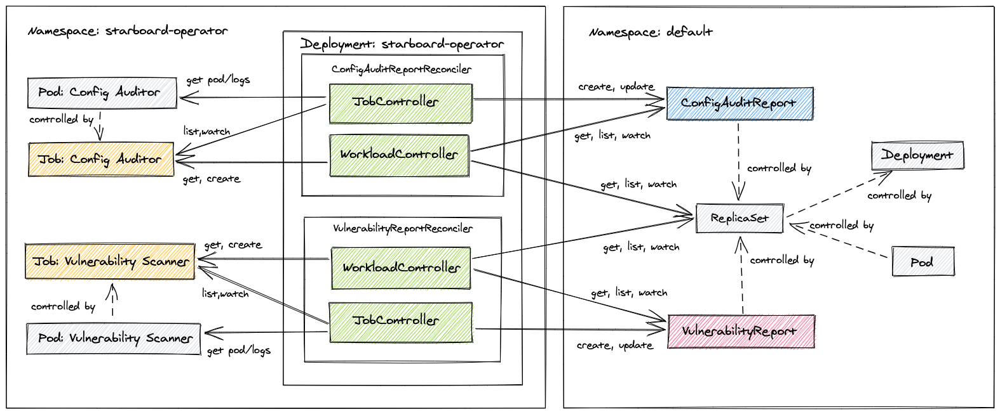
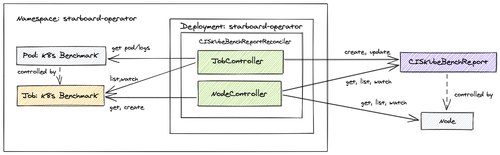
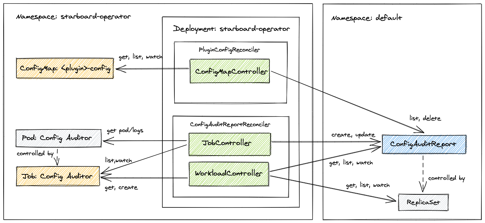

Starboard integrates security tools into the Kubernetes environment, so that users can find and view the risks that relate to different resources in a Kubernetes-native way.

Starboard can be run in two different modes:

* As a [command](https://aquasecurity.github.io/starboard/v0.10.0/cli/) (CLI), so you can trigger scans and view the risks in a kubectl-compatible way or as part of your CI/CD pipeline.
* As an [operator](https://aquasecurity.github.io/starboard/v0.10.0/operator/) to automatically update security reports in response to workload and other changes on a Kubernetes cluster - for example, initiating a vulnerability scan when a new pod is started.

> :eyes: NOTE
>
> Even though manual scanning through the command-line is useful, the fact that it's not automated makes it less suitable with a large number of Kubernetes workloads. Therefore, the `operator` provides a better option for these scenarios, constantly monitoring built-in Kubernetes resources, such as Deployments, and running appropriate scanners against the underlying deployment descriptors.

# The Starboard CLI

Starboard CLI is a single executable binary which can be used to find risks, such as vulnerabilities or insecure pod descriptors, in Kubernetes workloads. By default, the risk assessment reports are stored as [custom resources](https://aquasecurity.github.io/starboard/v0.10.0/crds/).

To learn more about the available Starboard CLI commands, run `starboard help` or type a command followed by the `-h` flag:

```console
$ starboard scan kubehunterreports -h
```

For a demo, please check this [youtube video](https://youtu.be/cgcwIY1HVI0?t=119).

## Installation

The chosen install method here is the fastest one. Assuming you have already installed [Krew](https://github.com/kubernetes-sigs/krew), you can install starboard simply by:

```console
$ kubectl krew install starboard
$ kubectl starboard help
```

If you already installed Starboard plugin with Krew, you can upgrade it to the latest version with:

```console
$ kubectl krew upgrade starboard
```

> :memo: NOTE
>
> For more details on how to install it via the `binary releases`, check [this](https://aquasecurity.github.io/starboard/v0.10.1/cli/installation/binary-releases/).

> :memo: NOTE
>
> For more details on how to install from the `sources`, check [this](https://aquasecurity.github.io/starboard/v0.10.1/cli/installation/source/).

## Getting started

The Starboard CLI allows us to run manual (mainly) tasks on our Kubernetes cluster to enhance security in different areas.

For more details, please consult the [official docs](https://aquasecurity.github.io/starboard/v0.10.1/cli/getting-started/)

### Scanning Workloads

To begin with, execute the following one-time setup command:

```console
$ kubectl starboard init
```

The `init` subcommand creates the `starboard` namespace, in which Starboard executes Kubernetes jobs to perform scans. It also sends custom security resources definitions to the Kubernetes API:

```console
$ kubectl api-resources --api-group aquasecurity.github.io
NAME                   SHORTNAMES    APIGROUP                 NAMESPACED   KIND
ciskubebenchreports    kubebench     aquasecurity.github.io   false        CISKubeBenchReport
configauditreports     configaudit   aquasecurity.github.io   true         ConfigAuditReport
kubehunterreports      kubehunter    aquasecurity.github.io   false        KubeHunterReport
vulnerabilityreports   vuln,vulns    aquasecurity.github.io   true         VulnerabilityReport
```

Let's assume we have an old version of `nginx` deployed that we know has some vulnerabilities. Let's say we want to run the vulnerability scanner and some audit reports.

To run the vulnerability scanner to generate vulnerability reports, we can:

```console
$ kubectl starboard scan vulnerabilityreports deployment/nginx
```

Behind the scenes, by default this uses [Trivy](https://github.com/aquasecurity/trivy) in Standalone mode to identify vulnerabilities in the container images associated with the specified deployment.

As we know, Kubernetes default configs might not be the more secure settings. If we'd like to know how to run the scanner to audit the configuration using `Polaris`:

```console
$ kubectl starboard scan configauditreports deployment/nginx
```

After that, we can retrieve the configuration audit report with:

```console
$ kubectl starboard get configaudit deployment/nginx -o yaml
```

### Generating HTML reports

Once we've scanned a `Deployment` for vulnerabilities (i.e., `Trivy` or another scanner) and checked its configuration (i.e. Polaris or another tool) you can generate an HTML report of identified risks:

```console
$ kubectl starboard get report deployment/nginx > nginx.deploy.html
```

This is a report example:


# The Starboard Operator

This operator automatically updates security report resources in response to workload and other changes on a Kubernetes cluster - for example, **initiating a vulnerability scan and configuration audit when a new Pod is started**.

## Overview

Workload reconcilers discover K8s controllers, manage scan jobs, and create **VulnerabilityReport** and **ConfigAuditReport** objects:



Similarly, the operator performs infrastructure checks by watching Kubernetes cluster nodes and executing CIS Kubernetes Benchmark for each of them. Infrastructure reconciler discovers K8s nodes, manages scan jobs, and creates **CISKubeBenchReport** objects:



The desired state for the controllers managed by this operator is that for each workload or node there are security reports stored in the cluster as custom resources. Each custom resource is owned by a built-in resource to inherit its life cycle. Beyond that, we take advantage of Kubernetes garbage collector to automatically delete stale reports and trigger rescan.

A rescan is also triggered whenever a config of a configuration audit plugin has changed. This is implemented by adding the label named `plugin-config-hash` to ConfigAuditReport instances. The plugins' config reconciler watches the ConfigMap that holds plugin settings and computes a hash from the ConfigMap's data. The hash is then compared with values of the `plugin-config-hash` labels. If hashes are not equal then affected ConfigAuditReport objects are deleted, which in turn triggers rescan - this time with new plugin's configuration.



The `plugin configuration reconciler` deletes ConfigAuditReports whenever the configuration changes.

> :eyes: INFO
>
> Currently, the operator supports [`vulnerabilityreports`](https://aquasecurity.github.io/starboard/v0.10.1/crds/#vulnerabilityreport), [`configauditreports`](https://aquasecurity.github.io/starboard/v0.10.1/crds/#configauditreport), and [`ciskubebenchreports`](https://aquasecurity.github.io/starboard/v0.10.1/crds/#ciskubebenchreport) security resources. There is a plan to support [`kubehunterreports`](https://aquasecurity.github.io/starboard/v0.10.1/crds/#kubehunterreport). We also plan to implement rescan on configurable schedule, for example every 24 hours.

For more details, please check the [official documentation](https://aquasecurity.github.io/starboard/v0.10.0/operator/).

## Installation

> :memo: NOTE
>
> These instructions are for a `kubectl`-based installation. For the `helm`-based install, please check [these instructions](https://aquasecurity.github.io/starboard/v0.10.1/operator/installation/helm/).

For more information, please chech the [official install guide](https://aquasecurity.github.io/starboard/v0.10.1/operator/installation/kubectl/).

The operator will be installed via provided static YAML manifests with fixed values. If you want to change the container image or modify default configuration settings, you'll have to edit existing manifests or customize them with tools such as [Kustomize](https://kustomize.io/). For now, we'll install the operator in the `starboard-operator` namespace and configure it to watch the `default` namespace.

1. Send custom resource definitions (CRDs) to the Kubernetes API

```console
$ kubectl apply \
    -f https://raw.githubusercontent.com/aquasecurity/starboard/v0.10.1/deploy/crd/vulnerabilityreports.crd.yaml \
    -f https://raw.githubusercontent.com/aquasecurity/starboard/v0.10.1/deploy/crd/configauditreports.crd.yaml \
    -f https://raw.githubusercontent.com/aquasecurity/starboard/v0.10.1/deploy/crd/ciskubebenchreports.crd.yaml \
    -f https://raw.githubusercontent.com/aquasecurity/starboard/v0.10.1/deploy/crd/kubehunterreports.crd.yaml
```

> :eyes: NOTE
>
> For the latest version, take the YAMl files from the following path:
>```console
> https://raw.githubusercontent.com/aquasecurity/starboard/main/deploy/crd/{crd-file-name}.yaml
> ```

2. Send the following Kubernetes objects definitions to the Kubernetes API:

```console
$ kubectl apply \
    -f https://raw.githubusercontent.com/aquasecurity/starboard/v0.10.1/deploy/static/01-starboard-operator.ns.yaml \
    -f https://raw.githubusercontent.com/aquasecurity/starboard/v0.10.1/deploy/static/02-starboard-operator.sa.yaml \
    -f https://raw.githubusercontent.com/aquasecurity/starboard/v0.10.1/deploy/static/03-starboard-operator.clusterrole.yaml \
    -f https://raw.githubusercontent.com/aquasecurity/starboard/v0.10.1/deploy/static/04-starboard-operator.clusterrolebinding.yaml
```

3. (Optional) Configure Starboard by creating the starboard ConfigMap and the starboard secret in the starboard-operator namespace.

For example, you can use Trivy in [ClientServer](https://aquasecurity.github.io/starboard/v0.10.1/integrations/vulnerability-scanners/trivy/#clientserver) mode or [Aqua Enterprise](https://aquasecurity.github.io/starboard/v0.10.1/integrations/vulnerability-scanners/aqua-enterprise/) as an active vulnerability scanner. If you skip this step, the operator will ensure [configuration objects](https://aquasecurity.github.io/starboard/v0.10.1/settings/) on startup with the default settings:

```console
$ kubectl apply -f https://raw.githubusercontent.com/aquasecurity/starboard/v0.10.1/deploy/static/05-starboard-operator.config.yaml
```

Next, we review the default values and makes sure the operator is configured properly:

```console
$ kubectl describe cm starboard -n starboard-operator
Name:         starboard
Namespace:    starboard-operator
Labels:       <none>
Annotations:  <none>

Data
====
conftest.imageRef:
----
openpolicyagent/conftest:v0.23.0
kube-bench.imageRef:
----
docker.io/aquasec/kube-bench:0.5.0
polaris.imageRef:
----
quay.io/fairwinds/polaris:3.2
trivy.severity:
----
UNKNOWN,LOW,MEDIUM,HIGH,CRITICAL
configAuditReports.scanner:
----
Polaris
trivy.imageRef:
----
docker.io/aquasec/trivy:0.16.0
trivy.mode:
----
Standalone
trivy.serverURL:
----
http://trivy-server.trivy-server:4954
vulnerabilityReports.scanner:
----
Trivy
Events:  <none>
```

```console
$ kubectl describe secret starboard -n starboard-operator
Name:         starboard
Namespace:    starboard-operator
Labels:       <none>
Annotations:  <none>

Type:  Opaque

Data
====
```

4. Finally, create the `starboard-operator` Deployment in the `starboard-operator` namespace to start the operator's pod:

```console
$ kubectl apply -f https://raw.githubusercontent.com/aquasecurity/starboard/v0.10.1/deploy/static/06-starboard-operator.deployment.yaml
```

5. To confirm that the operator is running, check the number of replicas created by the `starboard-operator` Deployment in the `starboard-operator` namespace:

```console
$ kubectl get deployment -n starboard-operator
NAME                 READY   UP-TO-DATE   AVAILABLE   AGE
starboard-operator   1/1     1            1           28h
```

If for some reason it's not ready yet, check the logs of the Deployment for errors:

```console
$ kubectl logs deployment/starboard-operator -n starboard-operator
```

## Getting started

For more details about the starboard operator usage, please check the [original docs](https://aquasecurity.github.io/starboard/v0.10.1/operator/getting-started/)

Next, a scenario of usage of the `starboard-operator` for integrated security.

### Workloads Scanning

Assuming that you installed the operator in the `starboard-operator` namespace, and it's configured to discover Kubernetes workloads in the `default` namespace, let's create the `nginx` Deployment that we know is vulnerable:

```console
$ kubectl create deployment nginx --image nginx:1.16
```

When the first ReplicaSet controlled by the `nginx` Deployment is created, the operator immediately detects that and creates the Kubernetes Job in the `starboard-operator` namespace to scan the `nginx:1.16` image for vulnerabilities. It also creates the Job to audit the Deployment's configuration for common pitfalls such as running the `nginx` container as root:

```console
$ kubectl get job -n starboard-operator
scan-configauditreport-c4956cb9d     0/1           1s         1s
scan-vulnerabilityreport-c4956cb9d   0/1           1s         1s
```

If everything goes fine, the scan Jobs are **deleted**, and the operator saves scan reports as custom resources in the `default` namespace, named after the Deployment's active ReplicaSet. For image vulnerability scans, the operator creates a VulnerabilityReport for each different container defined in the active ReplicaSet. In this example there is just one container image called `nginx`:

```console
$ kubectl get vulnerabilityreports -o wide
NAME                                REPOSITORY      TAG    SCANNER   AGE   CRITICAL   HIGH   MEDIUM   LOW   UNKNOWN
replicaset-nginx-7ff78f74b9-nginx   library/nginx   1.16   Trivy     12s   4          40     26       90    0
```

Similarly, the operator creates a **ConfigAuditReport** holding the result of auditing the configuration of the active ReplicaSet controlled by the `nginx` Deployment:

```console
$ kubectl get configauditreports -o wide
NAME                          SCANNER   AGE   DANGER   WARNING   PASS
replicaset-nginx-7ff78f74b9   Polaris   33s   1        9         7
```

Notice that scan reports generated by the operator are controlled by Kubernetes workloads. In our example, **VulnerabilityReport** and **ConfigAuditReport** objects are controlled by the active ReplicaSet of the `nginx` Deployment:

```console
$ kubectl tree deploy nginx
NAMESPACE  NAME                                                       READY  REASON  AGE
default    Deployment/nginx                                           -              104s
default    └─ReplicaSet/nginx-7ff78f74b9                              -              104s
default      ├─Pod/nginx-7ff78f74b9-6bkmn                             True           104s
default      ├─ConfigAuditReport/replicaset-nginx-7ff78f74b9          -              102s
default      └─VulnerabilityReport/replicaset-nginx-7ff78f74b9-nginx  -              90s
```

Moving forward, let's update the container image of the `nginx` Deployment from `nginx:1.16` to `nginx:1.17`. This will trigger a rolling update of the Deployment and eventually create another ReplicaSet:

```console
$ kubectl set image deployment nginx nginx=nginx:1.17
```

Even this time the operator will pick up changes and rescan our Deployment with updated configuration:

```console
kubectl tree deploy nginx
NAMESPACE  NAME                                                       READY  REASON  AGE
default    Deployment/nginx                                           -              6m36s
default    ├─ReplicaSet/nginx-549f5fcb58                              -              2m47s
default    │ ├─Pod/nginx-549f5fcb58-l8dhc                             True           2m47s
default    │ ├─ConfigAuditReport/replicaset-nginx-549f5fcb58          -              2m45s
default    │ └─VulnerabilityReport/replicaset-nginx-549f5fcb58-nginx  -              2m37s
default    └─ReplicaSet/nginx-7ff78f74b9                              -              6m36s
default      ├─ConfigAuditReport/replicaset-nginx-7ff78f74b9          -              6m34s
default      └─VulnerabilityReport/replicaset-nginx-7ff78f74b9-nginx  -              6m22s
```

realize that the operator knows how to attach **VulnerabilityReport** and **ConfigAuditReport** objects to build-in Kubernetes objects so that looking them up is easy. What's more, in this approach where a custom resource inherits a life cycle of the built-in resource we could leverage Kubernetes garbage collection. For example, when the previous ReplicaSet named `nginx-7ff78f74b9` is deleted the **VulnerabilityReport** named `replicaset-nginx-7ff78f74b9-nginx` as well as the **ConfigAuditReport** named `replicaset-nginx-7ff78f74b9` are automatically *garbage collected*.

### Infrastructure Scanning

The operator discovers also Kubernetes nodes and runs **CIS Kubernetes Benchmark** checks on each of them. The results are stored as **CISKubeBenchReport** objects. In other words, for a cluster with 3 nodes the operator will eventually create 3 benchmark reports:

```console
$ kubectl get node
NAME                    STATUS   ROLES                  AGE   VERSION
tfm-k8s-control-plane   Ready    control-plane,master   30h   v1.20.2
tfm-k8s-worker          Ready    <none>                 30h   v1.20.2
tfm-k8s-worker2         Ready    <none>                 30h   v1.20.2
```

```console
$ kubectl get ciskubebenchreports -o wide
NAME                    SCANNER      AGE   FAIL   WARN   INFO   PASS
tfm-k8s-control-plane   kube-bench   29h   11     40     0      71
tfm-k8s-worker          kube-bench   29h   1      27     0      19
tfm-k8s-worker2         kube-bench   29h   1      27     0      19
```

Notice that each **CISKubeBenchReport** is named after a node and is controlled by that node to inherit its life cycle:

```console
$ kubectl tree node tfm-k8s-control-plane -A
NAMESPACE        NAME                                                 READY  REASON        AGE
                 Node/tfm-k8s-control-plane                           True   KubeletReady  30h
                 ├─CISKubeBenchReport/tfm-k8s-control-plane           -                    29h
                 ├─CSINode/tfm-k8s-control-plane                      -                    30h
kube-node-lease  ├─Lease/tfm-k8s-control-plane                        -                    30h
kube-system      ├─Pod/etcd-tfm-k8s-control-plane                     True                 30h
kube-system      ├─Pod/kube-apiserver-tfm-k8s-control-plane           True                 30h
kube-system      ├─Pod/kube-controller-manager-tfm-k8s-control-plane  True                 30h
kube-system      └─Pod/kube-scheduler-tfm-k8s-control-plane           True                 30h
```

